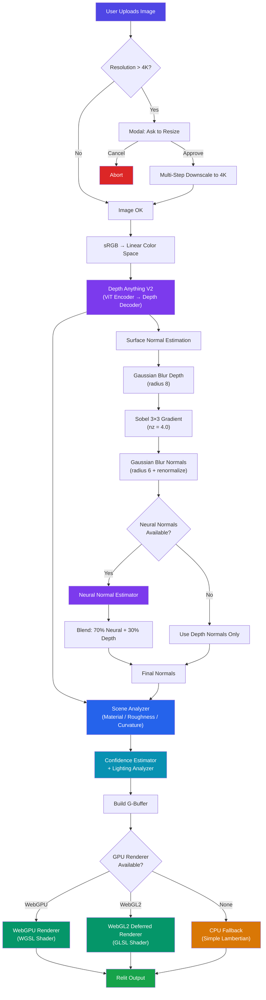
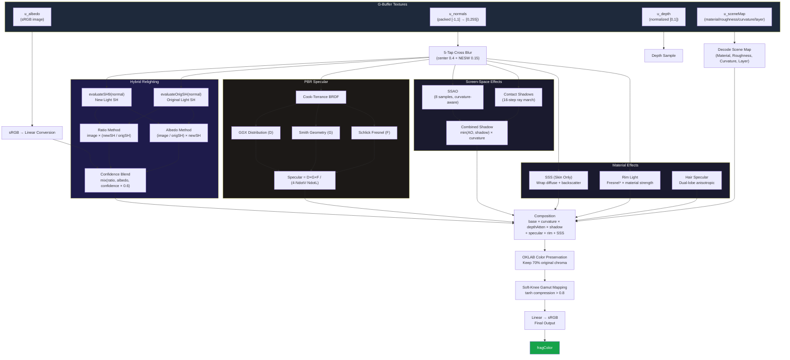
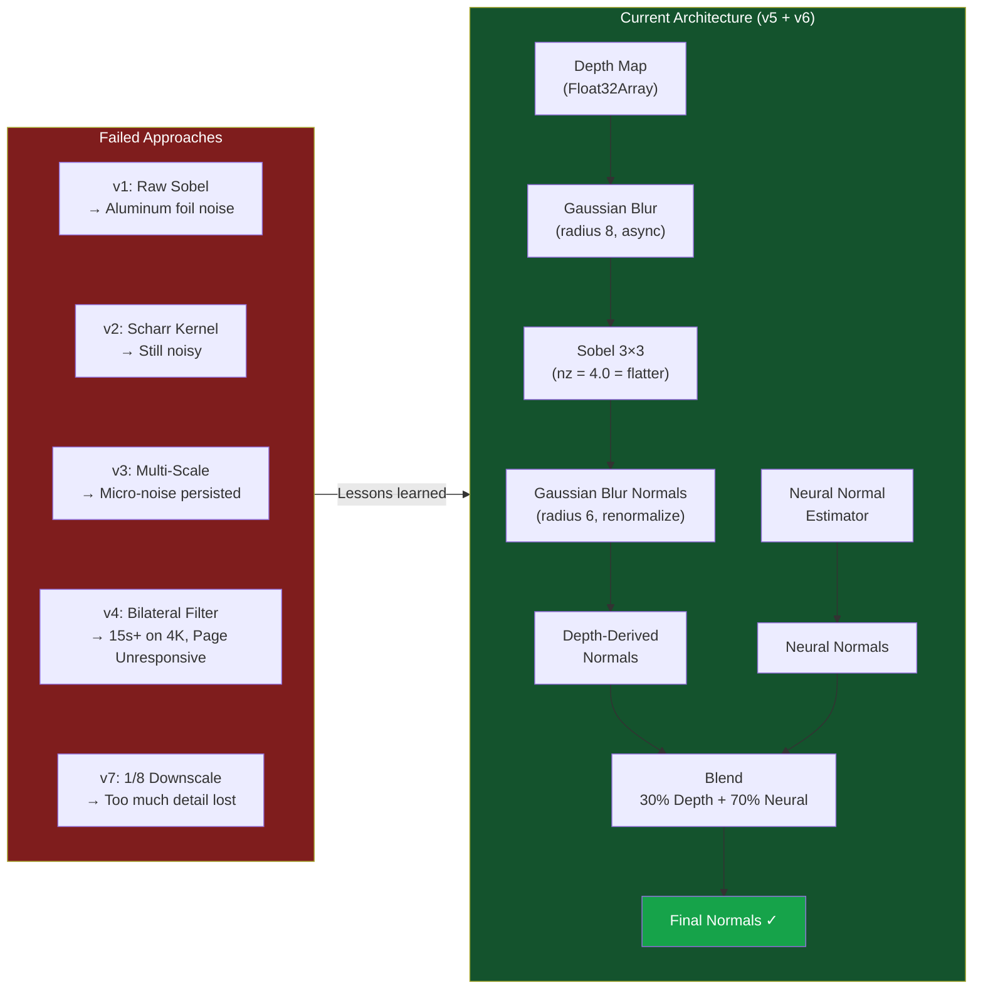
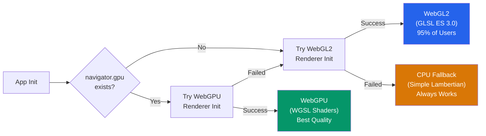
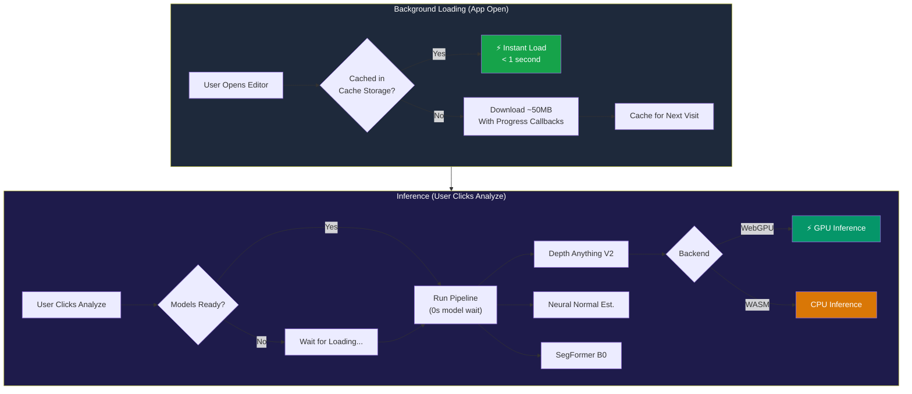

# Orlume - AI Photo Editor

Transform your photos with AI-powered depth estimation, dynamic relighting, and 3D effects.


## Features

- **AI Depth Estimation** — Depth Anything V2 model via Transformers.js
- **Dynamic Relighting** — Place lights, cast shadows, Blinn-Phong shading
- **3D View** — Three.js displacement mapping from depth
- **Parallax Effect** — Depth-based layered motion
- **Fully Browser-Based** — No server required, runs on WebGPU/WASM




### GPU Shader Rendering Pipeline

What happens inside the fragment shader on every frame:



### Normal Estimation Evolution

The iterative journey through 7 approaches:



### GPU Backend Fallback Chain



### ML Model Loading Strategy




## Getting Started

```bash
# Clone the repository
git clone https://github.com/kunal0230/Orlume.git
cd Orlume

# Install dependencies
npm install

# Start development server
npm run dev
```

Open http://localhost:5173/ in your browser.

## Usage

1. **Upload** an image (drag & drop or click)
2. **Estimate Depth** — AI generates depth map
3. **Relight** — Click to place lights, drag to move, right-click to delete
4. **3D View** — Explore the scene in 3D
5. **Export** — Save your edited image

## Tech Stack

- **Vite** — Build tool
- **Transformers.js** — AI model inference
- **Three.js** — 3D rendering
- **WebGPU** — Hardware acceleration

## License

MIT
