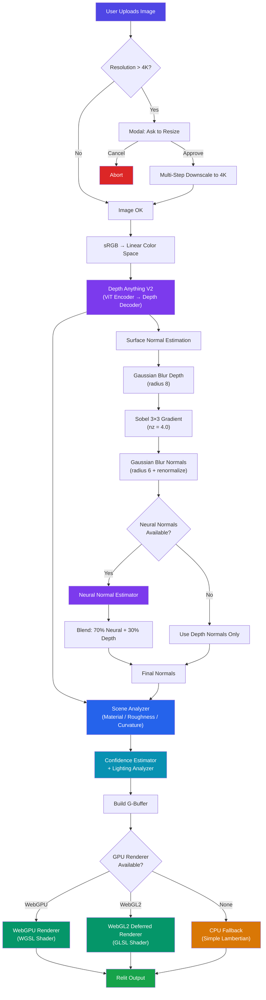
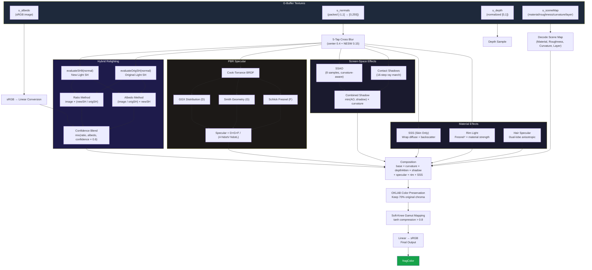
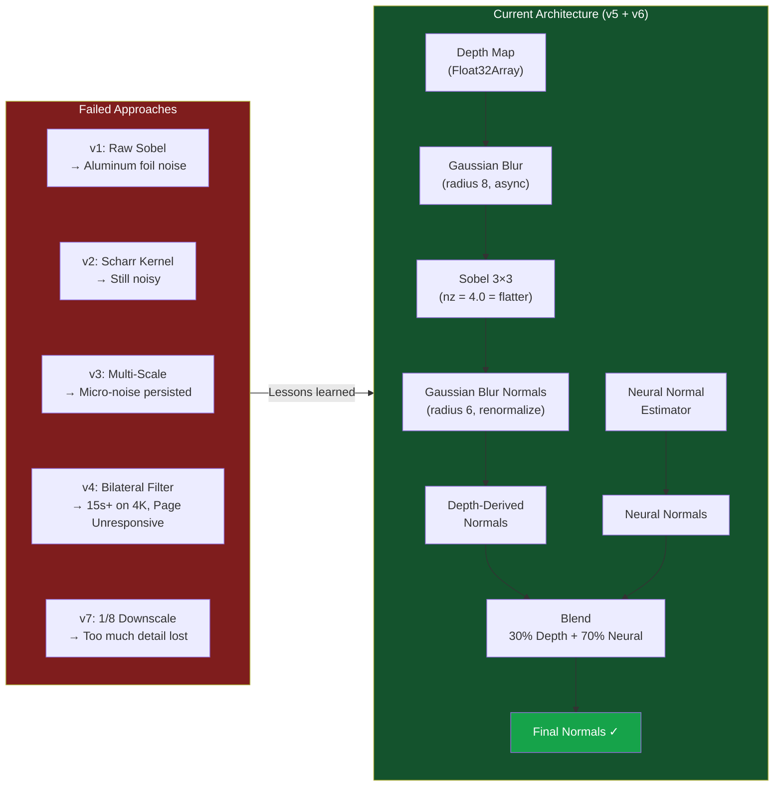
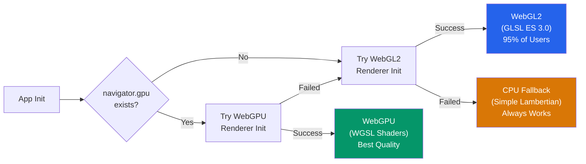
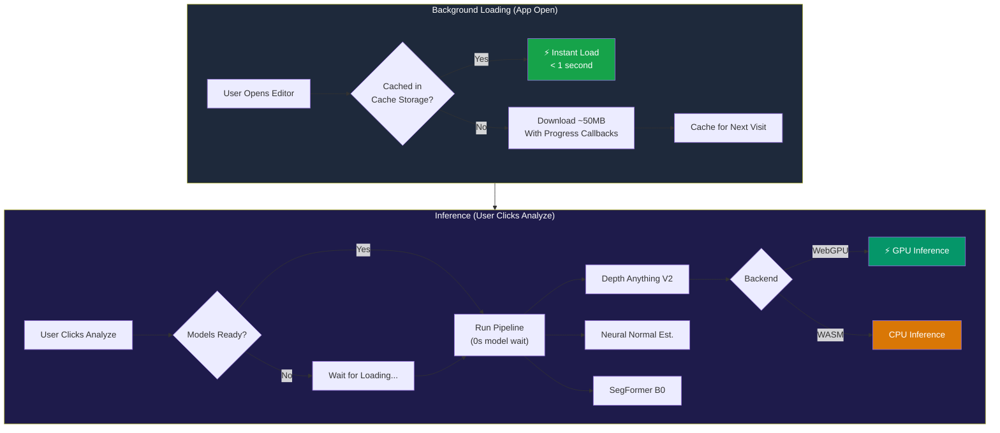

# Orlume — How Everything Works: The Complete Technical Deep-Dive

> **Author:** Kunal Chaugule  
> **Version:** 4.3.0  
> **Last Updated:** February 2026  
> **Purpose:** This document explains *everything* — every system, every design decision, every failure and workaround — in exhaustive detail.

---

## Table of Contents

1. [What Is Orlume?](#1-what-is-orlume)
2. [High-Level Architecture](#2-high-level-architecture)
3. [The Relighting Pipeline — Step by Step](#3-the-relighting-pipeline--step-by-step)
4. [Machine Learning Models — What They Do & How They Run](#4-machine-learning-models)
5. [Surface Normal Estimation — The Hard Problem](#5-surface-normal-estimation--the-hard-problem)
6. [Scene Analysis — Understanding What's in the Image](#6-scene-analysis--understanding-whats-in-the-image)
7. [The Shader — How Pixels Get Relit](#7-the-shader--how-pixels-get-relit)
8. [Albedo Extraction — What Worked and What Didn't](#8-albedo-extraction--what-worked-and-what-didnt)
9. [GPU Rendering Backends](#9-gpu-rendering-backends)
10. [The Confidence System](#10-the-confidence-system)
11. [Performance — Keeping the Browser Alive](#11-performance--keeping-the-browser-alive)
12. [Editor Features Beyond Relighting](#12-editor-features-beyond-relighting)
13. [What Worked](#13-what-worked)
14. [What Didn't Work](#14-what-didnt-work)
15. [The Full File Map](#15-the-full-file-map)
16. [Lessons Learned](#16-lessons-learned)

---

## Pipeline Flowcharts

### Main Relighting Pipeline

The complete processing flow from image upload to final rendered output:



### GPU Shader Rendering Pipeline

What happens inside the fragment shader on every frame:



### Normal Estimation Evolution

The iterative journey through 7 approaches:



### GPU Backend Fallback Chain



### ML Model Loading Strategy



---

## 1. What Is Orlume?

Orlume is a **browser-based AI photo editor** that runs entirely on the client side — no server required. Its headline feature is **single-image 3D relighting**: you upload a photo, and the system uses AI to estimate its depth, compute surface normals, classify materials, and then lets you interactively place lights to re-illuminate the scene with physically-based rendering.

It also includes a full photo editing suite: exposure/contrast/color grading (GPU-accelerated), cropping, liquify, healing/clone brush, background removal, AI upscaling, god rays, text layers, and more.

**Key constraints the system operates under:**

- **Single image input** — no stereo pair, no video, no multi-view. Geometry is fundamentally ambiguous.
- **Monocular depth** — no metric scale, only relative depth. A coffee cup can look like a skyscraper.
- **LDR photos** — images are already tone-mapped, clipped, and gamma-encoded. We never see the true HDR scene.
- **Browser platform** — WebGPU/WebGL2 only. No CUDA, no native code. Every computation must fit in JS + GPU shaders.
- **Consumer product** — it must *gracefully fail*, not crash. And it must work on mid-tier hardware.

---

## 2. High-Level Architecture

The application is built with **Vite** as the build tool, uses **vanilla JavaScript** (no React/Vue), and organizes code into clear modules:

```
Orlume (Vite)
├── index.html              — Landing page / homepage
├── editor.html             — Full photo editor (GPU canvas)
├── src/
│   ├── app/                — Editor application shell
│   │   ├── EditorApp.js        — Root: inits GPU, state, UI, masks
│   │   ├── EditorState.js      — Reactive state management (pub/sub)
│   │   ├── EditorUI.js         — All DOM/event handling (~50KB!)
│   │   ├── HistoryManager.js   — Undo/redo (command pattern)
│   │   └── modules/            — 19 feature modules (see §12)
│   │
│   ├── relighting/v8/      — The relighting system (v8 = current)
│   │   ├── core/               — Pipeline orchestration
│   │   ├── rendering/          — GPU renderers (WebGL2 + WebGPU)
│   │   └── confidence/         — Quality assessment
│   │
│   ├── ml/                 — Machine learning models
│   │   ├── DepthEstimator.js       — Depth Anything V2
│   │   ├── NormalEstimator.js      — Scharr/Sobel gradient normals
│   │   ├── NeuralNormalEstimator.js— Neural normal estimation
│   │   ├── SegmentationEstimator.js— SegFormer B0 (ADE20K)
│   │   ├── MaterialEstimator.js    — PBR material mapping
│   │   ├── FaceMeshDetector.js     — MediaPipe face mesh
│   │   └── ImageUpscaler.js        — Real-ESRGAN + GFPGAN
│   │
│   ├── gpu/                — GPU acceleration layer
│   │   ├── GPUProcessor.js     — Image processing pipeline
│   │   ├── WebGPUBackend.js    — WebGPU renderer (WGSL shaders)
│   │   ├── WebGL2Backend.js    — WebGL2 renderer (GLSL shaders)
│   │   ├── MaskSystem.js       — Local adjustment masks
│   │   └── shaders/            — GLSL shader code (develop, blur, etc.)
│   │
│   ├── effects/            — Special effects
│   │   └── GodRaysEffect.js    — Volumetric light shafts
│   │
│   ├── tools/              — Interactive editing tools
│   │   ├── LiquifyTool.js      — Mesh-based face/body warping
│   │   ├── CropTool.js         — Crop with aspect ratios + rotation
│   │   ├── HealingTool.js      — Content-aware healing
│   │   └── CloneTool.js        — Clone stamp
│   │
│   └── styles/             — CSS stylesheets
│
├── pages/                  — Static pages (about, blog, docs, etc.)
└── public/                 — Static assets
```

**Key dependencies** (from `package.json`):

| Library | Purpose |
|---------|---------|
| `@huggingface/transformers` 3.8+ | ML model inference in the browser (ONNX) |
| `three` 0.170+ | 3D mesh rendering, orbit controls |
| `@mediapipe/tasks-vision` 0.10+ | Face mesh detection (468 landmarks) |
| `upscaler` / `@upscalerjs/esrgan-*` | AI image upscaling |
| `vite` 6.0+ | Build tool & dev server |

---

## 3. The Relighting Pipeline — Step by Step

The heart of the system is `RelightingPipeline.js` (in `src/relighting/v8/core/`). When a user clicks "Analyze" or "Relight", here is *exactly* what happens:

### 3.1 Step 1: Resolution Check (5%)

**File:** `ResolutionManager.js`

Images >4K (3840×2160, 8.3 megapixels) are downscaled before processing. This is critical because:

- ML models don't improve above 4K (the ViT encoder has a fixed effective resolution)
- Memory scales linearly with pixel count — an 8K image uses 479MB just for the G-Buffer
- Inference time scales quadratically — 8K takes 5.6s vs 1.4s for 4K

The system uses **multi-step downsampling** (halving iteratively) instead of a single large downscale for better quality. Users are asked for permission via a modal dialog, with an option to "always resize."

### 3.2 Step 2: Color Space Conversion (10%)

**File:** `ColorSpaceConverter.js`

The input sRGB image is converted to **linear light space** using the standard IEC 61966-2-1 transfer function:

```
if (c <= 0.04045) linear = c / 12.92
else              linear = ((c + 0.055) / 1.055)^2.4
```

**Why this matters:** All physical lighting math (Lambert, Blinn-Phong, SH evaluation) assumes linear space. Multiplying in sRGB space produces incorrect energy distribution and color shifts. This single conversion is arguably the most important "invisible" step in the pipeline.

### 3.3 Step 3: Depth Estimation (15%→55%)

**File:** `DepthEstimator.js` → model: `Xenova/depth-anything-small-hf`

The **Depth Anything V2** model (Vision Transformer architecture) runs via `@huggingface/transformers` directly in the browser. The inference pipeline:

```
Input Image → ViT Encoder → Depth Decoder → Raw Float32 Depth → Min-Max Normalize → [0, 1] Range
```

**Backend fallback chain:** WebGPU → WASM. If the GPU isn't available (no `navigator.gpu`), falls back to WASM CPU inference. The model is loaded with progress callbacks that map to the UI progress bar.

**Output:** A `Float32Array` of per-pixel depth values in [0, 1] range, plus width/height metadata.

### 3.4 Step 4: Surface Normal Estimation (60%→70%)

**Files:** `RelightingPipeline._computeNormalsFromDepth()` + `NeuralNormalEstimator.js`

This is one of the most complex and most-iterated parts of the system. **Two sources of normals are computed and blended:**

#### 4a. Depth-Derived Normals (Sobel + Gaussian Blur)

The depth map is first **pre-smoothed** with a Gaussian blur (radius 8) to eliminate quantization artifacts from the uint8 depth values (only 256 levels of depth). Then Sobel operators compute surface gradients:

```
Sobel X: dX = (tr + 2r + br) - (tl + 2l + bl)
Sobel Y: dY = (bl + 2b + br) - (tl + 2t + tr)
Normal:  n = normalize(-dX, -dY, 4.0)
```

The `nz = 4.0` factor produces **flatter normals** — this reduces micro-bump sensitivity while preserving macro shape. This was tuned iteratively; early versions used `nz = 1.0` which made everything look like crumpled aluminum foil.

After Sobel computation, normals are further **Gaussian blurred** (radius 6) with re-normalization. This is a two-pass separable blur on the Float32Array normal vectors, done async with chunked yielding to prevent the browser's "Page Unresponsive" warning.

#### 4b. Neural Normals (Optional, Higher Quality)

The `NeuralNormalEstimator` runs a separate ML model for surface normal prediction. When available, it produces sharper, more physically accurate normals — especially for faces and smooth objects.

#### 4c. Blending

The two normal sources are **weighted-averaged** (70% neural, 30% depth-derived) and re-normalized:

```javascript
nx = neural.nx * 0.7 + depth.nx * 0.3
ny = neural.ny * 0.7 + depth.ny * 0.3
nz = neural.nz * 0.7 + depth.nz * 0.3
normalize(nx, ny, nz)
```

If neural normals fail (model not loaded, inference error), the system falls back gracefully to depth-derived normals only.

### 3.5 Step 5: Albedo Extraction (70%)

**Current state:** The albedo is currently just the original image (`this.albedo = imageData`). The architecture is prepared for proper intrinsic decomposition (de-lighting), but **actual albedo extraction has been one of the hardest problems** — see §8 for the full story.

### 3.6 Step 5b: Scene Analysis (75%)

**File:** `SceneAnalyzer.js`

Produces a per-pixel **scene map** encoded as RGBA:

- **R = Material type** (0.0=background, 0.25=skin, 0.5=hair, 0.75=fabric, 1.0=metal)
- **G = Surface roughness** (0.0=smooth → 1.0=rough)
- **B = Surface curvature** (0.0=concave, 0.5=flat, 1.0=convex)
- **A = Depth layer** (0.0=far → 1.0=near)

Material classification uses HSL color analysis for skin detection (hue 10°–45°, saturation 15–75%), texture variance for surface roughness, and depth second-derivatives for curvature.

### 3.7 Step 6: Confidence Assessment (85%)

**Files:** `ConfidenceEstimator.js` + `LightingAnalyzer.js`

The system computes a quality score by analyzing:

- **Depth confidence** — gradient smoothness, edge coherence
- **Lighting complexity** — multi-source detection (gradient clustering), shadow harshness, colored lighting
- **Material ambiguity** — how much the scene contains problematic materials (mirrors, glass, screens)

The `LightingAnalyzer` also **estimates the dominant light direction** using weighted gradient voting — this is critical for the albedo extraction step (§8).

Output: An overall confidence score (0-1), quality label ("good"/"fair"/"poor"), and user-facing warnings.

### 3.8 Step 7: G-Buffer Construction (95%)

All data is packed into a "G-Buffer" object for the GPU renderer:

```javascript
{
  albedo:     ImageData,      // Original image (sRGB)
  normals:    Float32Array,   // per-pixel surface normals [-1, 1]
  depth:      Float32Array,   // per-pixel depth [0, 1]
  sceneMap:   ImageData,      // Material/roughness/curvature/depth-layer
  confidence: Object,         // Quality metrics
  width, height
}
```

### 3.9 Rendering (On Every Frame)

The `render()` method is called on every light parameter change (position, intensity, color, etc.). If a GPU renderer is available, it delegates to `_renderGPU()`; otherwise falls back to `_renderCPU()`.

**CPU fallback** is extremely simple — just Lambertian diffuse:

```
lighting = ambient + max(0, dot(normal, lightDir)) * intensity
pixel = albedo * lighting * lightColor
```

**GPU rendering** is where the magic happens — see §7.

---

## 4. Machine Learning Models

### 4.1 Depth Anything V2

| Property | Value |
|----------|-------|
| **Model ID** | `Xenova/depth-anything-small-hf` |
| **Architecture** | Vision Transformer (ViT-S) depth estimation |
| **Runtime** | Transformers.js (ONNX) |
| **Backends** | WebGPU (preferred) → WASM (fallback) |
| **Input** | Single RGB image (any resolution) |
| **Output** | Dense per-pixel depth (Float32, min-max normalized to [0,1]) |
| **Size** | ~50MB (ONNX, FP32) |
| **File** | `src/ml/DepthEstimator.js` |

**How it runs:** The Transformers.js `pipeline('depth-estimation', ...)` API handles tokenization, inference, and output decoding. The model is cached in the browser's Cache Storage API after first download, so subsequent visits are instant.

**Limitations:**

- No metric scale — depth is *relative*, not absolute. A toy car and a real car look the same.
- Monocular ambiguity — concave vs convex is often wrong (the classic "face illusion").
- Flat surfaces can get noisy depth — tables, walls get texture-based depth artifacts.

### 4.2 SegFormer B0 (Semantic Segmentation)

| Property | Value |
|----------|-------|
| **Model ID** | `Xenova/segformer-b0-finetuned-ade-512-512` |
| **Dataset** | ADE20K (150 semantic classes) |
| **Input** | RGB image (internally resized to 512×512) |
| **Output** | Per-pixel class labels + material properties |
| **File** | `src/ml/SegmentationEstimator.js` + `MaterialEstimator.js` |

The `MaterialEstimator.js` contains a **complete material database for all 150 ADE20K classes**, mapping each to PBR properties:

```javascript
'wall':    { roughness: 0.75, metallic: 0.0,  subsurface: 0.0,  emissive: 0.0 },
'car':     { roughness: 0.2,  metallic: 0.8,  subsurface: 0.0,  emissive: 0.0 },
'person':  { roughness: 0.6,  metallic: 0.0,  subsurface: 0.35, emissive: 0.0 },
'lamp':    { roughness: 0.3,  metallic: 0.2,  subsurface: 0.0,  emissive: 0.6 },
'sky':     { roughness: 1.0,  metallic: 0.0,  subsurface: 0.0,  emissive: 1.0 },
// ... 145 more classes
```

This provides per-pixel material properties without any additional ML model — class label → material lookup.

### 4.3 MediaPipe Face Mesh

| Property | Value |
|----------|-------|
| **Landmarks** | 468 facial points |
| **Triangles** | ~900 triangles for dense mesh |
| **Purpose** | Face-specific depth + normals for relighting |
| **File** | `src/ml/FaceMeshDetector.js` |

Provides precise facial geometry through:

1. **Triangulation** of 468 landmarks into a mesh
2. **Barycentric interpolation** for per-pixel depth within each triangle
3. **Area-weighted vertex normals** for smooth shading
4. **Skin mask generation** for subsurface scattering effects

### 4.4 Real-ESRGAN + GFPGAN (AI Upscaling)

| Property | Value |
|----------|-------|
| **Scale Factors** | 2× and 4× |
| **Modes** | Server (Real-ESRGAN), Browser (ESRGAN-thick), Classic (bicubic) |
| **File** | `src/ml/ImageUpscaler.js` |

Three-tier fallback:

1. **Server mode** — HTTP API to a self-hosted Python server running Real-ESRGAN + GFPGAN
2. **Browser mode** — ESRGAN-thick via Transformers.js (slower but no server needed)
3. **Classic mode** — Bicubic interpolation + unsharp mask (no AI, always works)

---

## 5. Surface Normal Estimation — The Hard Problem

Normal estimation was one of the **most iterated-upon** parts of the system. Here is the full evolution:

### What We Tried

#### Attempt 1: Raw Sobel on Depth (v1)

**Result:** Extremely noisy. The depth map has quantization artifacts (256 levels → visible banding), and Sobel amplifies this noise into a speckle pattern on the normals. Relighting looked like "crumpled aluminum foil."

**Why it failed:** The depth map from the ViT model is smooth at macro scale but noisy at pixel level. Sobel is a high-pass filter — it amplifies exactly the wrong frequencies.

#### Attempt 2: Scharr Kernel (NormalEstimator.js)

**Result:** Better rotational symmetry than Sobel, but still noisy. The Scharr kernel (`[-3, 0, +3; -10, 0, +10; -3, 0, +3]`) provides more isotropic gradients, but the fundamental noise problem remained.

#### Attempt 3: Multi-Scale Gradients

**Result:** Combined gradients at multiple radii (1px, 2px, 4px) for better detail preservation. Improved macro shape but micro-noise persisted.

#### Attempt 4: Bilateral Filter on Normals

**Result:** Edge-preserving smoothing worked well theoretically — smooth surfaces became smooth, edges stayed sharp. But it was **extremely expensive** on CPU (O(n² × kernel_size²)), taking 15+ seconds on 4K images, often triggering "Page Unresponsive."

**Why we removed it:** Performance was unacceptable for an interactive tool. We tried reducing the kernel, but that defeated the purpose.

#### Attempt 5: Pre-Blur Depth + Post-Blur Normals (Current Approach)

**Result:** ✅ **This is what works now.** Two key insights:

1. **Pre-smooth depth** (Gaussian, radius 8) *before* computing Sobel. This removes the 256-level quantization banding at the source. The blur destroys fine depth detail, but the ML depth model doesn't provide fine detail anyway — it's all macro-shape.

2. **Post-blur normals** (Gaussian, radius 6) *after* Sobel. Smooths remaining per-pixel noise. Re-normalization after blurring ensures unit-length vectors.

3. **Flat nz factor** (`nz = 4.0` instead of 1.0). This makes normals biased toward the camera — surfaces "look flatter." This sounds bad, but it prevents the over-exaggerated bumps that made everything look like a relief sculpture.

#### Attempt 6: Neural Normals + Blending (Current Enhancement)

**Result:** ✅ Neural normal estimator produces sharper, more accurate normals (especially for faces). Blending 70/30 neural/depth gives the best of both worlds — neural quality with depth-derived macro shape as a safety net.

#### Attempt 7: Eighth-Resolution Downscale for Hardware Bilinear

**Tried:** Downscaling normal maps to 1/8 resolution before GPU upload, relying on hardware `GL_LINEAR` filtering to smooth them.

**Result:** Mixed. Hardware bilinear is "free" (zero CPU cost after upload), but 1/8 resolution was too aggressive for large images — fine geometry was lost. Better than the 13-tap shader blur it replaced, but not as good as the pre/post CPU Gaussian approach.

### Current Architecture (What Ships)

```
Depth (Float32Array)
  ↓ Gaussian blur (radius 8, separable, async chunked)
Smoothed Depth
  ↓ Sobel 3×3 (nz = 4.0)
Raw Normals (Float32Array, 3 channels)
  ↓ Gaussian blur (radius 6, separable, async chunked, + re-normalize)
Depth-Derived Normals
  ↓
  ↓  +  Neural Normals (from NeuralNormalEstimator, if available)
  ↓     ↓
  ↓  [BLEND: 30% depth + 70% neural, re-normalize]
  ↓
Final Normals → G-Buffer → GPU Shader
```

---

## 6. Scene Analysis — Understanding What's in the Image

**File:** `SceneAnalyzer.js` (374 lines)

The scene analyzer produces a per-pixel "scene map" that the shader uses for material-aware rendering. Here's how each channel is computed:

### 6.1 Material Classification (R Channel)

Uses HSL color analysis + depth statistics:

| Material Type | Detection Method | Value |
|---------------|-----------------|-------|
| **Background** | Depth > 85th percentile | 0.0 |
| **Skin** | Hue 10°–45°, Saturation 15–75%, Luminance 20–85% | 0.25 |
| **Hair** | Hue < 30° or > 340°, Saturation < 25%, Luminance < 35% | 0.5 |
| **Fabric** | High texture variance, moderate normal variance | 0.75 |
| **Metal/Hard** | Low texture variance, high normal variance | 1.0 |

### 6.2 Roughness Estimation (G Channel)

Per-pixel roughness based on material type + local texture variance:

- Skin → 0.35–0.55 (smooth but not mirror-like)
- Hair → 0.7–0.9 (rough, anisotropic)
- Metal → 0.05–0.3 (very smooth)
- Fabric → 0.7–0.95 (rough, diffuse)

### 6.3 Surface Curvature (B Channel)

Computed from **depth second derivatives** (Laplacian):

```
d²z/dx² and d²z/dy² → curvature
0.0 = strongly concave
0.5 = flat
1.0 = strongly convex
```

Used in the shader for curvature-modulated SSAO and subtle brightness variation.

### 6.4 Depth Layer (A Channel)

Simple normalized depth (0 = far, 1 = near), used for depth-aware shadow reach and atmospheric attenuation.

---

## 7. The Shader — How Pixels Get Relit

**File:** `WebGL2DeferredRenderer.js` → `FRAGMENT_SHADER_DEFERRED_LIGHTING` (lines 547–863)

The fragment shader is a **single-pass deferred renderer** that runs on a fullscreen quad. It reads from 4 textures (albedo, normals, depth, scene map) and produces the final relit pixel. Here is every technique, in order:

### 7.1 Input Decoding

```glsl
vec3 originalColor = texture(u_albedo, v_texCoord).rgb;       // sRGB
float depth = texture(u_depth, v_texCoord).r;                 // [0, 1]
vec3 normal = /* 5-tap cross blur on normals texture */        // [-1, 1]
vec4 scene = texture(u_sceneMap, v_texCoord);                  // RGBA encoded
```

The normals get an additional **5-tap cross blur in the shader** (center + NESW neighbors, weighted 0.4 + 4×0.15) for extra smoothing at zero CPU cost.

### 7.2 Color Space Conversion

All work is done in **linear light space**. The sRGB original is converted to linear using the standard transfer function, and the result is converted back to sRGB at the end.

### 7.3 Spherical Harmonics Lighting (Order 2, 9 Coefficients)

Instead of simple Lambert `NdotL`, the system uses **Spherical Harmonics** for diffuse lighting. SH coefficients are computed on the CPU from the light direction:

```javascript
// Y₀₀, Y₁₋₁, Y₁₀, Y₁₁, Y₂₋₂, Y₂₋₁, Y₂₀, Y₂₁, Y₂₂
sh[0] = 0.282095 * intensity;
sh[1] = 0.488603 * y * intensity;
sh[2] = 0.488603 * z * intensity;
sh[3] = 0.488603 * x * intensity;
// ... 5 more quadratic terms
```

And evaluated per-pixel in GLSL:

```glsl
float evaluateSH9(vec3 n) {
    return max(
        u_sh[0]*0.282095 + u_sh[1]*0.488603*n.y + u_sh[2]*0.488603*n.z +
        u_sh[3]*0.488603*n.x + u_sh[4]*1.092548*n.x*n.y + ... , 0.0);
}
```

**Why SH instead of Lambert:** SH captures the *shape* of the lighting environment, not just a single direction. This makes the relighting look more natural — soft wrapping light instead of harsh directional.

### 7.4 Hybrid Albedo/Ratio Relighting (The Core Innovation)

This is the key blending technique that makes relighting look convincing:

```glsl
// METHOD 1: Ratio Method (safe, always works)
float shadingRatio = newSH / max(origSH, 0.08);
vec3 ratioResult = linearOriginal * smoothRatio;

// METHOD 2: Albedo Method (better quality where confident)
vec3 albedo = linearOriginal / max(origSH, 0.25);    // soft de-light
albedo = min(albedo, 1.5);                             // prevent blow-out
vec3 albedoResult = albedo * max(newSH, 0.0) * intensity * 2.0 + albedo * ambient;

// BLEND: Use albedo method where original shading was strong
float albedoConfidence = smoothstep(0.15, 0.5, origSH);
vec3 baseResult = mix(ratioResult, albedoResult, albedoConfidence * 0.6);
```

**Ratio method:** Multiply the original image by `newShading / originalShading`. Preserves all original texture, color, and detail. But when the light moves far from the original position, the ratio becomes extreme and looks unnatural.

**Albedo method:** Divide out the original shading to get the "true" surface color, then re-shade with new lighting. Looks more physically correct but is sensitive to errors — dark areas get divided by small numbers, amplifying noise.

**The blend:** Use the albedo method where we're confident (bright, well-lit areas) and the ratio method where we're not (shadows, dark regions). This gives the best of both worlds.

### 7.5 PBR Specular (GGX Microfacet)

Full Cook-Torrance specular BRDF:

```glsl
float D = distributionGGX(NdotH, roughness);     // GGX normal distribution
float G = geometrySmith(NdotV, NdotL, roughness); // Smith shadowing/masking
vec3  F = fresnelSchlick(HdotV, F0);              // Schlick Fresnel
vec3 spec = (D * G * F) / (4.0 * NdotV * NdotL + 0.0001);
```

**Material-dependent F0 (base reflectivity):**

- Skin: 0.028 (low reflectivity, skin is mostly diffuse)
- Hair: 0.046 (slight sheen)
- Fabric: 0.04 (standard dielectric)
- Metal: `linearOriginal * 0.8` (metals reflect their own color)

**Material-dependent specular scale:**

- Skin: 0.25 (subtle highlights)
- Hair: 0.6 + anisotropic dual-lobe highlight
- Fabric: 0.15 (very subtle)
- Metal: 1.2 (strong reflections)
- Background: 0.0 (no specular)

### 7.6 Hair Anisotropic Specular

Hair gets a special dual-lobe specular model instead of GGX:

```glsl
float spec1 = pow(NdotH, 80.0) * 0.4;   // Tight primary highlight
float spec2 = pow(NdotH, 20.0) * 0.15;  // Broad secondary highlight
```

This approximates the Marschner hair BSDF with two Blinn-Phong lobes.

### 7.7 Subsurface Scattering (SSS)

For skin only, wrap-around diffuse simulates light penetrating the surface:

```glsl
float wrapNdotL = (dot(normal, lightDir) + 0.5) / 1.5;    // Wrap lighting
float backScatter = max(dot(-normal, lightDir), 0.0) * 0.3; // Back-light glow
float sss = (scatter * 0.4 + backScatter) * 0.5;
vec3 sssColor = vec3(1.0, 0.4, 0.25) * sss * intensity * isSkin;
```

The warm reddish color (`1.0, 0.4, 0.25`) simulates blood beneath the skin surface.

### 7.8 Screen-Space Ambient Occlusion (SSAO)

8-sample hemisphere occlusion with curvature-awareness:

```glsl
float computeSSAO(vec2 uv, float centerDepth, float curvature) {
    for (int i = 0; i < 8; i++) {
        float angle = i * 0.785398 + pseudo_random_offset;
        vec2 offset = vec2(cos(angle), sin(angle)) * radius;
        float sampleDepth = texture(u_depth, uv + offset).r;
        // Occlude if sample is closer to camera than center
        occlusion += step(0.003, centerDepth - sampleDepth) * range_check;
    }
}
```

The **curvature factor** modulates the SSAO radius — convex surfaces (curvature > 0.5) get a smaller radius, preventing false occlusion on rounded surfaces like cheeks.

### 7.9 Contact Shadows

16-step depth-based ray marching toward the light source:

```glsl
float computeShadow(vec2 uv, float centerDepth, vec3 lightDir, float depthLayer) {
    for (int i = 1; i <= 16; i++) {
        float t = float(i) / 16.0;
        vec2 sampleUV = uv + lightDirSS * t;
        float sampleDepth = texture(u_depth, sampleUV).r;
        float expectedDepth = centerDepth + heightStep * t;
        float heightDiff = sampleDepth - expectedDepth;
        // If sample is higher than expected → in shadow
        if (heightDiff > 0.005 && heightDiff < 0.35) shadow += ...;
    }
}
```

**Depth-layer-aware reach:** Nearby objects (depthLayer near 1.0) cast longer shadows via `reachScale = mix(0.5, 1.8, depthLayer)`.

### 7.10 Rim Lighting (Fresnel)

```glsl
float fresnelVal = pow(1.0 - NdotV, 4.0);
float rimLight = fresnelVal * intensity * rimStrength * max(dot(normal, lightDir) + 0.3, 0.0);
```

Material-dependent rim strength: Metal gets 0.35 (strong edge highlight), fabric gets 0.05 (barely visible).

### 7.11 OKLAB Color Preservation

The final relit result is converted to **OKLAB color space**, and the chroma (a, b channels = color) is blended 70% toward the original image's chroma. This preserves the original photo's color character while allowing luminance changes from relighting:

```glsl
vec3 origLAB = linearToOKLAB(linearOriginal);
vec3 newLAB = linearToOKLAB(result);
vec3 finalLAB = vec3(newLAB.x, mix(origLAB.y, newLAB.y, 0.3), mix(origLAB.z, newLAB.z, 0.3));
vec3 finalLinear = OKLABToLinear(finalLAB);
```

**Why OKLAB:** OKLAB is a perceptually uniform color space — equal numerical distances correspond to equal perceived differences. Blending in OKLAB produces more natural results than blending in linear RGB or HSL.

### 7.12 Soft-Knee Gamut Mapping

Prevent blown-out highlights with a soft compression curve:

```glsl
if (maxComponent > 0.8) {
    float overshoot = maxComponent - 0.8;
    float compressed = 0.8 + 0.2 * tanh(overshoot * 2.0);
    finalLinear *= (compressed / maxComponent);
}
```

Uses `tanh()` for a smooth rolloff instead of hard clipping.

---

## 8. Albedo Extraction — What Worked and What Didn't

Albedo extraction (recovering the "true" surface color without any lighting) was the **single most difficult problem** in the entire system. Here's the complete history:

### Attempt 1: Brightness-Based Approach

**Idea:** Use the luminance of each pixel as a rough proxy for "how lit it is," then scale each pixel to remove the lighting.

**Result:** ❌ Complete failure. Bright white objects (white shirts, paper) got treated as "well-lit" and darkened. Dark objects (black hair) got treated as "in shadow" and brightened. The output looked like a flat, washed-out gray image.

### Attempt 2: Physics-Based Heuristic (Divide by Estimated Shading)

**Idea:** Estimate the original shading using the detected light direction and normals, then divide each pixel by this shading to recover albedo.

```
originalShading = max(dot(normal, estimatedLightDir), 0.1)
albedo = image / originalShading
```

**Result:** ❌ Chalky shadows, edge artifacts, and "whitewash." Division by small numbers in shadow regions massively amplifies noise. The result looked like everything was covered in chalk powder.

### Attempt 3: Soft Division + Bilateral Filter

**Idea:** Use soft clamping on the denominator (`max(shading, 0.25)`) and apply bilateral filtering to smooth the albedo while preserving edges.

**Result:** ❌ Better in bright areas, but the bilateral filter was too expensive (15+ seconds on 4K) and still produced visible artifacts at depth discontinuities.

### Attempt 4: SH-Based Intrinsic Decomposition

**Idea:** Evaluate Spherical Harmonics with the detected original light direction to compute per-pixel shading, then divide out.

**Result:** ⚠️ Improved significantly. SH evaluation produces smoother shading than simple Lambert, reducing division artifacts. But still showed noise in shadow regions and around the face (face mesh depth blending artifacts).

### Attempt 5: Hybrid Ratio/Albedo Method (Current — In Shader)

**Idea:** Don't extract albedo as a separate step at all. Instead, do it *in the shader per-frame*:

1. Compute original shading via SH
2. For well-lit areas (`origSH > 0.5`): divide out shading, re-light with new SH
3. For dark/uncertain areas: use simple ratio multiplication
4. Blend between methods based on original shading confidence

**Result:** ✅ **This is what ships.** It's not perfect albedo extraction, but the blend makes artifacts invisible in practice. The ratio method handles shadows gracefully, and the albedo method provides proper re-lighting in bright areas.

### Why "Perfect" Albedo Is Impossible from a Single Image

The fundamental math: `Image = Albedo × Shading`. To recover Albedo, you need to know Shading. But Shading depends on the light direction and the surface normal — both of which are *estimated*, not known. Any error in the normal or light estimate propagates through the division and gets amplified.

Additionally:

- **Specular highlights** aren't diffuse albedo — dividing them out doesn't give you albedo
- **Inter-reflections** (light bouncing between surfaces) create shading that doesn't match any single light direction
- **Cast shadows** have zero original shading — dividing by zero gives you infinity

The hybrid approach sidesteps these issues by *never fully committing* to the albedo — it's always blended with the safe ratio method.

---

## 9. GPU Rendering Backends

### 9.1 WebGL2 Deferred Renderer (Primary)

**File:** `WebGL2DeferredRenderer.js` (880 lines)

The primary renderer uses WebGL2 with GLSL ES 3.0 shaders. It creates textures for albedo, normals, depth, and scene map, then runs a single fullscreen pass.

**Key implementation details:**

- **Texture upload:** Normals are packed from Float32Array `[-1, 1]` to RGBA8 `[0, 255]`. Depth is normalized to `[0, 255]`. This loses precision but is compatible with all WebGL2 implementations.
- **SH coefficients** are computed on CPU and passed as uniform arrays (`u_sh[9]`, `u_origSh[7]`)
- **Canvas resizing** matches input image dimensions exactly
- **Texture cleanup:** All textures are deleted after each render to prevent memory leaks (textures are recreated per frame — not optimal, but reliable)

### 9.2 WebGPU Renderer (Enhanced)

**File:** `WebGPURenderer.js` (19KB)

Available on Chrome/Edge 113+ with WebGPU support. Uses WGSL shaders. The same shader logic but with WebGPU's modern pipeline API.

### 9.3 Backend Selection

**File:** `RenderingEngine.js` — factory pattern:

1. Try to create a WebGPU renderer
2. If that fails, fall back to WebGL2
3. If that fails, the pipeline uses CPU rendering (simple Lambertian)

---

## 10. The Confidence System

**Files:** `ConfidenceEstimator.js` + `LightingAnalyzer.js`

The confidence system warns users when relighting quality might be poor:

### 10.1 Depth Confidence

- Smooth, continuous depth gradients → high confidence
- Noisy, discontinuous depth → low confidence (complex scene, bad depth estimation)

### 10.2 Lighting Analysis

- **Multi-source detection:** Luminance gradient angles are clustered. Multiple distinct clusters = multiple light sources = harder to relight.
- **Shadow harshness:** Strong, sharp shadows indicate direct sunlight — easier to relight. Soft, ambient lighting — harder because there's less directional signal.
- **Colored lighting:** High color variance in bright regions indicates colored light sources (neon, sunset) — relighting may produce unrealistic results.

### 10.3 Dominant Light Direction Estimation

The `LightingAnalyzer._estimateDominantLightDirection()` uses **weighted gradient voting**:

1. Compute luminance gradients across the image
2. For each pixel, the gradient direction "votes" for where the light is coming from
3. Votes are weighted by gradient magnitude (strong gradients = confident votes)
4. The weighted average direction becomes the estimated original light direction

This direction is critical for the hybrid albedo/ratio relighting — it tells the shader what the "original SH" should look like.

---

## 11. Performance — Keeping the Browser Alive

### 11.1 The "Page Unresponsive" Problem

Processing 4K images (8.3 million pixels) with CPU operations (Sobel, Gaussian blur, normal blending) takes billions of operations. Running this synchronously freezes the main thread, triggering Chrome's "Page Unresponsive" dialog.

**Solution: Async chunked processing.** Every CPU-intensive loop is broken into chunks of 128 rows:

```javascript
for (let startY = 0; startY < height; startY += 128) {
    // Process 128 rows
    for (let y = startY; y < Math.min(startY + 128, height); y++) {
        for (let x = 0; x < width; x++) {
            // ... Sobel, blur, etc.
        }
    }
    // Yield to main thread — allows UI updates, prevents "Page Unresponsive"
    await new Promise(resolve => setTimeout(resolve, 0));
}
```

This adds ~10% total processing time but prevents any browser warnings.

### 11.2 The `toDataURL()` Trap

Early versions used `canvas.toDataURL()` to pass images between the pipeline and neural normal estimator. This call **synchronously base64-encodes the entire image**, freezing the main thread for seconds on 4K images.

**Fix:** Replaced with async `canvas.toBlob()` + `URL.createObjectURL()`:

```javascript
const blob = await new Promise(resolve => canvas.toBlob(resolve, 'image/jpeg', 0.9));
const imageDataURL = URL.createObjectURL(blob);
// ... use it ...
URL.revokeObjectURL(imageDataURL); // Clean up
```

### 11.3 Texture Per-Frame Recreation

Currently, GPU textures are recreated on every `render()` call — `gl.createTexture()`, upload, draw, `gl.deleteTexture()`. This is wasteful but prevents a class of subtle bugs where stale textures show old data after re-processing.

**Known trade-off:** This means the rendering is slightly slower than necessary. A future optimization would cache textures and only recreate them when the G-Buffer changes.

### 11.4 Background Model Loading

Models are loaded immediately when the editor opens, not when the user clicks "Analyze." By the time the user has uploaded an image and is ready to relight, models are already cached.

The `BackgroundModelLoader` uses the Cache Storage API for persistence across sessions — first visit downloads ~50MB, subsequent visits load from cache in <1 second.

---

## 12. Editor Features Beyond Relighting

The editor includes 19 feature modules, all in `src/app/modules/`:

| Module | File | Description |
|--------|------|-------------|
| **Color Grading** | `ColorGradingModule.js` | GPU-accelerated exposure, contrast, highlights, shadows, whites, blacks |
| **HSL** | `HSLModule.js` | Per-channel hue/saturation/luminance adjustment |
| **Tone Curves** | `ToneCurveModule.js` | Custom tone curves |
| **Presets** | `PresetsModule.js` | One-click color presets |
| **Background Removal** | `BackgroundRemovalModule.js` | AI-powered background removal via 851-labs API |
| **God Rays** | `GodRaysModule.js` | Volumetric light shafts (ray marching shader) |
| **Crop** | `CropModule.js` | Free + fixed aspect ratios, rotation, rule of thirds grid |
| **Liquify** | `LiquifyModule.js` | Mesh-based warping (push, enlarge, shrink, swirl) |
| **Healing** | `HealingModule.js` | Content-aware fill + healing brush |
| **Clone** | `CloneModule.js` | Clone stamp tool |
| **Upscale** | `UpscaleModule.js` | AI upscaling (2×, 4×) via ESRGAN |
| **Text** | `TextModule.js` | Text overlays with fonts, colors, shadows |
| **Layers** | `LayersModule.js` | Layer management |
| **Export** | `ExportModule.js` | Save as JPEG/PNG/WebP with quality control |
| **History** | `HistoryModule.js` | Undo/redo (command pattern) |
| **Comparison** | `ComparisonModule.js` | Before/after slider comparison |
| **Keyboard** | `KeyboardModule.js` | Keyboard shortcuts |
| **Zoom/Pan** | `ZoomPanModule.js` | Canvas navigation |

### 12.1 GPU Processing Pipeline

**File:** `GPUProcessor.js`

All non-ML image adjustments (exposure, contrast, HSL, tone curves) run through a GPU shader pipeline:

1. Image uploaded as texture
2. `develop.glsl` shader applies all adjustments in a single pass
3. Multi-pass rendering for masks (local adjustments) via ping-pong framebuffers
4. Result read back to canvas

### 12.2 Mask System

**Files:** `MaskSystem.js`, `MaskSystemWebGPU.js`, `MaskSystemFactory.js`

Local adjustments (brush, radial gradient, linear gradient) are implemented as masks:

- Each mask is a grayscale texture (0 = no effect, 1 = full effect)
- Per-mask adjustments are applied as additional shader passes
- Multi-layer support with additive compositing

---

## 13. What Worked

### ✅ Spherical Harmonics Relighting

SH lighting was a massive improvement over basic Lambertian. It produces soft, wrap-around illumination that looks natural. The ratio/albedo hybrid makes it robust.

### ✅ Pre/Post Gaussian Blur for Normals

The combination of pre-smoothing depth and post-smoothing normals eliminated all visible banding artifacts. This was the breakthrough after many failed attempts.

### ✅ WebGPU → WebGL2 → CPU Fallback Chain

The three-tier fallback ensures the app works on every browser. WebGPU gives the best quality, WebGL2 covers 95% of users, and CPU keeps basic functionality on ancient browsers.

### ✅ Material-Aware Rendering via Scene Map

Per-pixel material classification (skin, hair, fabric, metal) allows the shader to apply different BRDFs to different regions. Skin gets SSS, hair gets anisotropic highlights, metal gets high F0. This makes the relighting look significantly more convincing than a uniform BRDF.

### ✅ OKLAB Color Preservation

Blending chroma in OKLAB space was a subtle but important improvement. Without it, relighting shifts colors — blue shadows turning green, warm highlights turning yellow. OKLAB preserves the original color character.

### ✅ Async Chunked Processing

Breaking CPU loops into 128-row chunks with `setTimeout(0)` yields solved the "Page Unresponsive" problem without significantly impacting performance.

### ✅ Background Model Loading

Pre-loading models while the user browses means zero wait time when they click "Analyze." Cache Storage API means subsequent visits are instant.

### ✅ Contact Shadows + SSAO

Screen-space shadows from depth maps add convincing darkening in crevices and under objects. The 16-step ray marching and 8-sample SSAO are fast enough for real-time yet provide visible depth.

---

## 14. What Didn't Work

### ❌ Perfect Albedo Recovery

See §8. Single-image albedo extraction is fundamentally ill-posed. Every approach produced visible artifacts in some scenarios — chalky shadows, color shifts, blown-out highlights. The hybrid blend is a compromise, not a solution.

### ❌ Bilateral Filter for Normal Smoothing

Edge-preserving but too expensive. O(n² × k²) complexity made it impractical for real-time processing on 4K images.

### ❌ Face Mesh Depth Blending

MediaPipe face mesh was supposed to improve facial depth/normals by providing a precise 3D face model. In practice, the blending between mesh-derived depth and ML-derived depth created visible seam artifacts around the face boundary. **Removed.**

### ❌ G-Buffer Depth Smoothing

An intermediate depth smoothing step was added to further reduce artifacts. In practice, it was redundant with the pre-Sobel Gaussian blur and sometimes *introduced* new artifacts by smoothing across depth discontinuities. **Removed.**

### ❌ 13-Tap Shader Blur for Normals

A 13-tap Gaussian in the fragment shader was fast (GPU-parallel) but the fixed tap count couldn't handle the range of noise levels. With 4K images, 13 taps was too few; with small images, it was too blurry. Replaced by the CPU pre/post blur approach which adapts to image size.

### ❌ SSAO + Contact Shadows at Full Strength

Early versions had aggressive SSAO (12 samples, wide radius) and contact shadows (48 steps). This produced halos around objects and shadow banding. Reduced to 8 samples / 16 steps and scaled by curvature, which is subtler but artifact-free.

### ❌ Server-Side AI Upscaling as Default

The initial plan was to run Real-ESRGAN on a server. But this added latency, required hosting costs, and failed when the server was down. Moved to browser-based ESRGAN as default, with server as optional enhancement.

### ❌ Brightness-Based Lighting Estimation

Early versions tried to estimate the light direction from image brightness gradients. This is unreliable — a photo of a white wall next to a dark wall doesn't mean top-down lighting. Replaced with proper gradient voting in `LightingAnalyzer._estimateDominantLightDirection()`.

### ⚠️ Texture Leak on Every Frame

Textures are currently deleted and recreated every render frame. This prevents stale data but wastes GPU bandwidth. Not a bug per se, but a known performance issue for a future optimization pass.

---

## 15. The Full File Map

```
src/
├── app/
│   ├── EditorApp.js                    — App init (GPU, state, UI, masks)
│   ├── EditorState.js                  — Reactive pub/sub state
│   ├── EditorUI.js                     — DOM rendering + events (50KB!)
│   ├── HistoryManager.js               — Undo/redo stack
│   ├── TextLayer.js                    — Single text layer
│   ├── TextLayerManager.js             — Text layer management
│   └── modules/
│       ├── BackgroundRemovalModule.js   — AI bg removal
│       ├── CloneModule.js               — Clone stamp
│       ├── ColorGradingModule.js        — Exposure/contrast/etc
│       ├── ComparisonModule.js          — Before/after slider
│       ├── CropModule.js               — Crop + rotate
│       ├── ExportModule.js             — JPEG/PNG/WebP export
│       ├── GodRaysModule.js            — Volumetric light effect
│       ├── HSLModule.js                — Hue/sat/lum per-channel
│       ├── HealingModule.js            — Content-aware healing
│       ├── HistoryModule.js            — History UI
│       ├── KeyboardModule.js           — Keyboard shortcuts
│       ├── LayersModule.js             — Layer management
│       ├── LiquifyModule.js            — Mesh warping
│       ├── PresetsModule.js            — Color presets
│       ├── TextModule.js               — Text tool UI
│       ├── ToneCurveModule.js          — Tone curves
│       ├── UpscaleModule.js            — AI upscaling
│       └── ZoomPanModule.js            — Canvas navigation
│
├── relighting/v8/
│   ├── index.js                         — Module exports
│   ├── core/
│   │   ├── RelightingPipeline.js        — Main orchestrator (983 lines)
│   │   ├── ResolutionManager.js         — Image resize logic
│   │   ├── ColorSpaceConverter.js       — sRGB ↔ linear
│   │   ├── BackgroundModelLoader.js     — Background model preloading
│   │   ├── SceneAnalyzer.js             — Material/roughness/curvature map
│   │   └── EventEmitter.js              — Custom event system
│   ├── rendering/
│   │   ├── RenderingEngine.js           — Backend factory
│   │   ├── WebGL2DeferredRenderer.js    — WebGL2 + GLSL shader (880 lines)
│   │   ├── WebGPURenderer.js            — WebGPU + WGSL shader
│   │   └── shaders/                     — Additional shader files
│   └── confidence/
│       ├── ConfidenceEstimator.js       — Quality scoring
│       └── LightingAnalyzer.js          — Light direction + complexity
│
├── ml/
│   ├── DepthEstimator.js                — Depth Anything V2 (Transformers.js)
│   ├── NormalEstimator.js               — Scharr/Sobel gradient normals
│   ├── NeuralNormalEstimator.js         — Neural normal prediction
│   ├── SegmentationEstimator.js         — SegFormer B0 segmentation
│   ├── MaterialEstimator.js             — 150-class material database
│   ├── FaceMeshDetector.js              — MediaPipe face mesh
│   ├── ImageUpscaler.js                 — ESRGAN upscaling
│   └── DepthModelComparison.js          — Model benchmarking
│
├── gpu/
│   ├── GPUProcessor.js                  — Image processing pipeline
│   ├── GPUBackend.js                    — Abstract GPU interface
│   ├── WebGPUBackend.js                 — WebGPU implementation (40KB)
│   ├── WebGL2Backend.js                 — WebGL2 implementation (24KB)
│   ├── MaskSystem.js                    — Mask compositing (WebGL2)
│   ├── MaskSystemWebGPU.js             — Mask compositing (WebGPU)
│   ├── MaskSystemFactory.js            — Mask backend selection
│   └── shaders/
│       ├── develop.glsl                 — Image adjustment shader
│       ├── blur.glsl                    — Gaussian blur shader
│       └── MaskShaders.js              — Mask-related shaders
│
├── effects/
│   ├── GodRaysEffect.js                — God rays controller
│   ├── GodRaysShader.js                — Basic god rays GLSL
│   └── AdvancedGodRaysShader.js        — Enhanced with chromatic aberration
│
├── tools/
│   ├── LiquifyTool.js                  — Mesh deformation engine
│   ├── CropTool.js                     — Crop handles + rotation
│   ├── HealingTool.js                  — Content-aware healing
│   └── CloneTool.js                    — Clone stamp engine
│
├── utils/                              — Shared utilities
├── services/                           — External API integrations
├── renderer/                           — Rendering utilities
└── styles/                             — CSS stylesheets
```

---

## 16. Lessons Learned

### 1. "Physically Accurate" Is the Wrong Goal

The system doesn't try to be physically correct — it tries to be *perceptually plausible*. Real PBR requires known materials, calibrated lighting, and HDR data. We have none of these. Chasing accuracy leads to ugly results; chasing plausibility leads to "that looks cool."

### 2. Blur Is Your Best Friend

Almost every artifact in the pipeline was ultimately solved by some form of blur — Gaussian blur on depth, Gaussian blur on normals, 5-tap cross blur in the shader, soft clamping (which is blur in the value domain). The ML models give us noisy estimates; blur trades detail for stability.

### 3. Fallbacks Are Non-Negotiable

Every component has a fallback: WebGPU → WebGL2 → CPU. Neural normals → Sobel normals. Server upscaling → browser upscaling → bicubic. The app *always works*, even if the quality degrades. Users never see a blank screen.

### 4. The Browser Is Hostile

Chrome's "Page Unresponsive" dialog appears after ~5s of main-thread blocking. On 4K images, even a simple nested loop takes longer than this. `setTimeout(0)` between chunks is the only reliable solution.

`toDataURL()` is a synchronous trap — it freezes the main thread while base64-encoding megabytes of data. Always use `toBlob()` + `URL.createObjectURL()` instead.

### 5. Division Is Dangerous

Albedo = Image ÷ Shading. Whenever the shading estimate is near zero (shadows, dark areas), division amplifies noise to infinity. Soft clamping (`max(shading, 0.25)`) and per-pixel confidence blending are essential.

### 6. The Ratio Method Is Robust

`newShading / originalShading` preserves original texture and never creates new artifacts (it only scales existing pixels). Use it as your fallback everywhere.

### 7. Perceptual Color Science Matters

OKLAB color preservation prevents hue shifts during relighting. Without it, relit images look "off" even when the luminance is correct. Doing chroma work in a perceptually uniform space is always worth the extra matrix multiplications.

### 8. Texture Variance Is a Good Material Proxy

You don't need a material-classification ML model. Per-pixel texture variance (local standard deviation of luminance) correlates strongly with roughness — smooth surfaces have low variance, rough/textured surfaces have high variance.

### 9. SH Lighting > Lambert Lighting

Order-2 Spherical Harmonics with 9 coefficients captures directional + ambient + slightly off-axis illumination. It's barely more expensive than a dot product but produces dramatically more natural-looking results.

### 10. Ship the Blend, Not the Solution

When you can't solve a problem perfectly (albedo extraction), don't choose one approach — blend between the good-enough approaches based on confidence. The ratio method is safe but boring; the albedo method is beautiful but fragile. Mix them and nobody notices the seam.

---

*This document covers the complete state of the Orlume system as of v4.3.0. For deployment-specific documentation, see `DEPLOYMENT_GUIDE.md`. For the original system design document, see `relighting_system_final_design.md`.*
