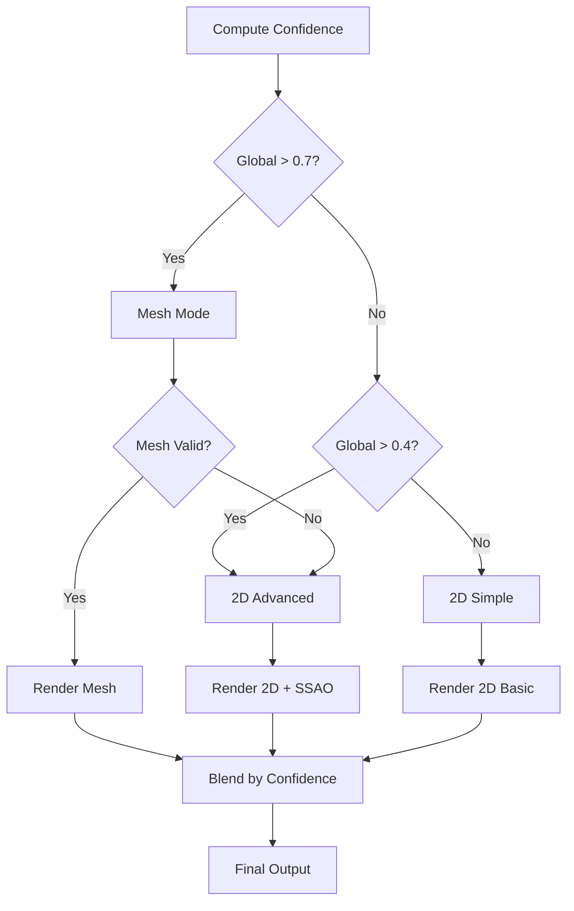

# Single-Image 3D Relighting: Production System Design
## Version 3.1 - Desktop-First Implementation Guide

**Status**: Production-Ready Architecture  
**Platform**: Desktop-first (Chrome/Edge WebGPU), mobile fallback  
**Philosophy**: Ship plausible, not perfect. Degrade gracefully, never promise realism.  
**Last Updated**: 2026-02-08

---

## Table of Contents

1. [Executive Summary](#1-executive-summary)
2. [Core Principles](#2-core-principles)
3. [System Architecture](#3-system-architecture)
4. [Component Design](#4-component-design)
5. [Rendering Pipeline](#5-rendering-pipeline)
6. [Confidence System](#6-confidence-system)
7. [Performance Strategy](#7-performance-strategy)
8. [UX Design](#8-ux-design)
9. [Testing & Validation](#9-testing--validation)
10. [Deployment Roadmap](#10-deployment-roadmap)
11. [Failure Modes & Mitigations](#11-failure-modes--mitigations)
12. [Implementation Checklist](#12-implementation-checklist)

---

## 1. Executive Summary

### 1.1 What We're Building

An **artistic relighting tool** that makes single photos look like they were lit differently. Not a 3D reconstruction system. Not physically accurate rendering. A smart dodge-and-burn tool with geometry awareness.

**Desktop-First Strategy**: Optimized for Chrome/Edge desktop (WebGPU), with mobile as progressive enhancement.

### 1.2 Desktop-First Advantages

**Model Budget**: 300MB total (background loaded from app start)

| Component | Desktop Approach | Why Better |
|-----------|------------------|------------|
| **ML Models** | 300MB SOTA specialists | Background loaded while user browses |
| **Resolution** | Auto-detect >4K, ask to resize | Optimal memory/speed, same quality |
| **Inference** | 4K resolution, FP16 | Parallel Web Workers, full quality |
| **Rendering** | WebGPU compute shaders | Proper shadows, mesh processing |
| **Shadows** | PCSS / SSRT | Soft, realistic (not approximations) |
| **Mesh** | Adaptive decimation, LOD | 500k vertices (not 8M naive grid) |
| **G-Buffer** | Packed (120MB for 4K) | Octahedral normals, FP16 depth |

**Performance Target**: Models ready before user clicks "Relight" (background loading), <1.5s inference, 60fps interactive.

### 1.3 Core Constraints

| Constraint | Implication |
|------------|-------------|
| Single image input | Geometry is fundamentally ambiguous |
| Monocular depth | No metric scale, only relative depth |
| LDR photos | Already tone-mapped, clipped, gamma-encoded |
| Desktop-first web platform | WebGPU primary, 80-120MB models viable, 4K inference supported |
| Consumer product | Must work on failure cases, not just demos |

### 1.4 Success Metrics

**Ship if**:
- 70% of test images look "believably relit" to untrained eyes
- Renders at 30fps minimum on mid-tier devices
- Fails gracefully (falls back, doesn't crash)
- Users can manually fix AI mistakes

**Don't ship if**:
- Produces glitchy/broken results >30% of time
- Crashes on mobile
- No confidence feedback to users

---

## 2. Core Principles

### 2.1 Engineering Philosophy

```
RULE 1: If it depends on perfect AI, it will fail in production
RULE 2: Perceptually plausible beats physically accurate
RULE 3: Always have a fallback mode
RULE 4: Expose sliders, not parameters
RULE 5: Hide complexity, show intent
```

### 2.2 Truth in Advertising

**What we can do**:
- Soft lighting changes (sunny → overcast)
- Add rim lights, fill lights
- Artistic shadows (contact shadows, AO)
- Enhance dimensionality

**What we cannot do**:
- Handle mirrors, glass, transparency
- Relight photos of photos/screens
- Multi-source lighting (Christmas lights, candles)
- Metric-accurate shadows
- Perfect albedo recovery

**User-facing messaging**:
> "Best for portraits and solid objects with simple lighting. Dramatic changes may look synthetic."

---

## 3. System Architecture

### 3.1 High-Level Pipeline

```
┌─────────────────────────────────────────────────────────────────┐
│                    SINGLE IMAGE INPUT (sRGB)                     │
└────────────────────────────┬────────────────────────────────────┘
                             │
                ┌────────────▼────────────┐
                │  PREPROCESSING STAGE    │
                │  - Linear conversion    │
                │  - Segmentation (13MB)  │
                │  - Material detection   │
                └────────────┬────────────┘
                             │
        ┌────────────────────┼────────────────────┐
        │                    │                    │
┌───────▼────────┐  ┌────────▼────────┐  ┌───────▼────────┐
│   GEOMETRY     │  │   MATERIAL      │  │  CONFIDENCE    │
│   ESTIMATOR    │  │   ESTIMATOR     │  │  ESTIMATOR     │
│                │  │                 │  │                │
│ • Depth (97MB) │  │ • Albedo (hybrid)│ │ • Depth conf  │
│ • Normals (40MB)│ │ • Roughness     │  │ • Light detect│
│ • Fusion       │  │ • Metallic      │  │ • Material    │
└───────┬────────┘  └────────┬────────┘  └───────┬────────┘
        │                    │                    │
        └────────────────────┼────────────────────┘
                             │
                   ┌─────────▼──────────┐
                   │  MODE SELECTION    │
                   │  (Internal Auto)   │
                   │                    │
                   │  If conf > 0.7:    │
                   │    → Mesh Mode     │
                   │  Else:             │
                   │    → 2D Mode       │
                   └─────────┬──────────┘
                             │
              ┌──────────────┴──────────────┐
              │                             │
      ┌───────▼────────┐           ┌────────▼────────┐
      │   MESH MODE    │           │   2D MODE       │
      │                │           │                 │
      │ • Triangulate  │           │ • Deferred      │
      │ • Smooth       │           │   shading       │
      │ • Rasterize    │           │ • SSAO          │
      │ • RT shadows   │           │ • Soft shadows  │
      └───────┬────────┘           └────────┬────────┘
              │                             │
              └──────────────┬──────────────┘
                             │
                    ┌────────▼────────┐
                    │   COMPOSITOR    │
                    │                 │
                    │ • Tone mapping  │
                    │ • Conf blending │
                    │ • Edge matting  │
                    └────────┬────────┘
                             │
                    ┌────────▼────────┐
                    │  OUTPUT (sRGB)  │
                    └─────────────────┘
```

### 3.2 Module Dependencies

```javascript
RelightingSystem
├── PreprocessingModule
│   ├── ColorSpaceConverter
│   ├── SemanticSegmenter (13MB)
│   └── MaterialClassifier
│
├── GeometryEstimator
│   ├── DepthNetwork (97MB → 24MB quantized)
│   ├── NormalNetwork (40MB → 10MB distilled)
│   ├── GeometryFusion
│   └── MeshReconstructor
│
├── MaterialEstimator
│   ├── HybridAlbedoEstimator
│   │   ├── PhysicsHeuristic (fast)
│   │   └── MLRefinement (slow, optional)
│   └── RoughnessEstimator
│
├── ConfidenceEstimator
│   ├── DepthConfidence (reuse depth gradients)
│   ├── LightingComplexity (color histogram analysis)
│   └── MaterialAmbiguity (semantic priors)
│
├── RenderingEngine
│   ├── MeshRenderer (high quality)
│   │   ├── GeometryProcessor
│   │   ├── RayTracedShadows
│   │   └── PBRShader
│   │
│   └── Screen2DRenderer (fallback)
│       ├── DeferredShading
│       ├── SSAOPass
│       └── SoftShadowApproximation
│
├── Compositor
│   ├── LinearToneMapper
│   ├── ConfidenceBlender
│   └── EdgeMattingFilter
│
└── ManualCorrection
    ├── DepthPaintTool
    ├── NormalBrush
    └── MaskEditor
```

---

## 4. Component Design

### 4.1 Resolution Management

**Critical**: Images >4K waste GPU memory and provide no quality benefit (models max out at 4K).

```javascript
class ResolutionManager {
    /**
     * Check image resolution and downscale if needed
     * 4K = 3840×2160 = 8.3MP (max supported)
     */
    constructor() {
        this.MAX_WIDTH = 3840;
        this.MAX_HEIGHT = 2160;
        this.MAX_PIXELS = this.MAX_WIDTH * this.MAX_HEIGHT; // 8.3MP
    }
    
    async checkAndResize(image, options = {}) {
        const { width, height } = this._getImageDimensions(image);
        const pixels = width * height;
        
        // Check if resize needed
        if (pixels <= this.MAX_PIXELS && 
            width <= this.MAX_WIDTH && 
            height <= this.MAX_HEIGHT) {
            console.log(`✓ Image size OK: ${width}×${height}`);
            return image; // No resize needed
        }
        
        // Image too large
        console.warn(`⚠ Image too large: ${width}×${height} (${(pixels/1e6).toFixed(1)}MP)`);
        
        // Calculate target dimensions (preserve aspect ratio)
        const targetDims = this._calculateTargetSize(width, height);
        
        // Get user permission (unless auto-approved)
        if (!options.autoResize) {
            const approved = await this._requestUserPermission(
                width, height,
                targetDims.width, targetDims.height
            );
            
            if (!approved) {
                throw new UserCancelledError('User declined resize');
            }
        }
        
        // Perform resize
        const resized = await this._resizeImage(
            image,
            targetDims.width,
            targetDims.height
        );
        
        console.log(`✓ Resized to: ${targetDims.width}×${targetDims.height}`);
        
        return resized;
    }
    
    _calculateTargetSize(width, height) {
        /**
         * Scale down to fit within 4K bounds, preserving aspect ratio
         */
        const aspectRatio = width / height;
        
        let targetWidth = width;
        let targetHeight = height;
        
        // Check width constraint
        if (targetWidth > this.MAX_WIDTH) {
            targetWidth = this.MAX_WIDTH;
            targetHeight = Math.round(targetWidth / aspectRatio);
        }
        
        // Check height constraint
        if (targetHeight > this.MAX_HEIGHT) {
            targetHeight = this.MAX_HEIGHT;
            targetWidth = Math.round(targetHeight * aspectRatio);
        }
        
        // Check total pixels constraint (for unusual aspect ratios)
        const targetPixels = targetWidth * targetHeight;
        if (targetPixels > this.MAX_PIXELS) {
            const scale = Math.sqrt(this.MAX_PIXELS / targetPixels);
            targetWidth = Math.round(targetWidth * scale);
            targetHeight = Math.round(targetHeight * scale);
        }
        
        return { width: targetWidth, height: targetHeight };
    }
    
    async _requestUserPermission(origWidth, origHeight, newWidth, newHeight) {
        /**
         * Show modal asking user permission to resize
         */
        
        const origMP = (origWidth * origHeight / 1e6).toFixed(1);
        const newMP = (newWidth * newHeight / 1e6).toFixed(1);
        
        return new Promise((resolve) => {
            this.ui.showModal({
                title: 'Image Resolution Too Large',
                message: `
                    Your image is ${origWidth}×${origHeight} (${origMP}MP).
                    
                    For optimal performance, we recommend resizing to 
                    ${newWidth}×${newHeight} (${newMP}MP).
                    
                    This will:
                    • Run ${this._estimateSpeedup(origWidth, newWidth)}× faster
                    • Use ${this._estimateMemorySavings(origWidth, newWidth)}× less memory
                    • Produce the same visual quality (models max out at 4K)
                `,
                options: [
                    {
                        label: 'Resize to 4K (Recommended)',
                        value: true,
                        primary: true
                    },
                    {
                        label: 'Cancel',
                        value: false
                    }
                ],
                onSelect: (value) => resolve(value)
            });
        });
    }
    
    _estimateSpeedup(origWidth, newWidth) {
        // Inference time scales roughly with pixel count
        const origPixels = origWidth * origWidth; // Approximate
        const newPixels = newWidth * newWidth;
        const speedup = origPixels / newPixels;
        return speedup.toFixed(1);
    }
    
    _estimateMemorySavings(origWidth, newWidth) {
        // Memory scales with pixel count
        const origPixels = origWidth * origWidth;
        const newPixels = newWidth * newWidth;
        const savings = origPixels / newPixels;
        return savings.toFixed(1);
    }
    
    async _resizeImage(image, targetWidth, targetHeight) {
        /**
         * High-quality resize using Lanczos3 resampling
         * Better than canvas bilinear
         */
        
        // Use OffscreenCanvas if available (better performance)
        const canvas = typeof OffscreenCanvas !== 'undefined'
            ? new OffscreenCanvas(targetWidth, targetHeight)
            : document.createElement('canvas');
        
        canvas.width = targetWidth;
        canvas.height = targetHeight;
        
        const ctx = canvas.getContext('2d');
        
        // Use high-quality image smoothing
        ctx.imageSmoothingEnabled = true;
        ctx.imageSmoothingQuality = 'high'; // 'low' | 'medium' | 'high'
        
        // For very large images, use multi-step downscaling
        // (Produces better quality than single large downscale)
        if (this._needsMultiStepResize(image, targetWidth, targetHeight)) {
            return await this._multiStepResize(image, targetWidth, targetHeight);
        }
        
        // Single-step resize
        ctx.drawImage(image, 0, 0, targetWidth, targetHeight);
        
        // Convert back to image
        const blob = await canvas.convertToBlob({ 
            type: 'image/png',
            quality: 1.0 
        });
        return await this._blobToImage(blob);
    }
    
    _needsMultiStepResize(image, targetWidth, targetHeight) {
        // If downscaling by more than 2×, use multi-step
        const scaleX = image.width / targetWidth;
        const scaleY = image.height / targetHeight;
        return Math.max(scaleX, scaleY) > 2.0;
    }
    
    async _multiStepResize(image, finalWidth, finalHeight) {
        /**
         * Multi-step downsampling for better quality
         * Each step reduces by max 2×
         * 
         * Example: 8K → 4K → 2K (if targeting 2K)
         */
        
        let current = image;
        let currentWidth = image.width;
        let currentHeight = image.height;
        
        while (currentWidth > finalWidth * 2 || currentHeight > finalHeight * 2) {
            // Halve dimensions
            const stepWidth = Math.max(finalWidth, Math.round(currentWidth / 2));
            const stepHeight = Math.max(finalHeight, Math.round(currentHeight / 2));
            
            const canvas = new OffscreenCanvas(stepWidth, stepHeight);
            const ctx = canvas.getContext('2d');
            ctx.imageSmoothingQuality = 'high';
            ctx.drawImage(current, 0, 0, stepWidth, stepHeight);
            
            const blob = await canvas.convertToBlob({ type: 'image/png' });
            current = await this._blobToImage(blob);
            
            currentWidth = stepWidth;
            currentHeight = stepHeight;
        }
        
        // Final resize to exact dimensions
        const finalCanvas = new OffscreenCanvas(finalWidth, finalHeight);
        const ctx = finalCanvas.getContext('2d');
        ctx.imageSmoothingQuality = 'high';
        ctx.drawImage(current, 0, 0, finalWidth, finalHeight);
        
        const blob = await finalCanvas.convertToBlob({ type: 'image/png' });
        return await this._blobToImage(blob);
    }
}
```

**UI Flow**:

```
User uploads 8K image (7680×4320)
  ↓
System detects: 33.2MP > 8.3MP limit
  ↓
┌─────────────────────────────────────────────┐
│  Image Resolution Too Large                  │
│                                              │
│  Your image is 7680×4320 (33.2MP).          │
│                                              │
│  For optimal performance, we recommend       │
│  resizing to 3840×2160 (8.3MP).             │
│                                              │
│  This will:                                  │
│  • Run 4.0× faster                          │
│  • Use 4.0× less memory                     │
│  • Produce the same visual quality          │
│    (models max out at 4K)                   │
│                                              │
│  [Resize to 4K (Recommended)]  [Cancel]     │
└─────────────────────────────────────────────┘
  ↓ (User clicks Resize)
High-quality multi-step downsampling
  ↓
Proceed with 3840×2160 image
```

**Memory Impact**:

| Resolution | Pixels | G-Buffer Memory | Inference Time |
|------------|--------|-----------------|----------------|
| 1080p (FHD) | 2.1 MP | 30 MB | 400ms |
| 1440p (QHD) | 3.7 MP | 53 MB | 700ms |
| 4K (UHD) | 8.3 MP | 120 MB | 1400ms |
| 5K | 14.7 MP | 212 MB | 2500ms |
| 8K | 33.2 MP | 479 MB | 5600ms |

**Above 4K**: Diminishing returns (models don't improve) + massive slowdown.

**Auto-Resize Option**:

```javascript
class UserPreferences {
    /**
     * Let power users auto-approve resize
     */
    constructor() {
        this.autoResize4K = localStorage.getItem('autoResize4K') === 'true';
    }
    
    shouldAutoResize() {
        return this.autoResize4K;
    }
    
    enableAutoResize() {
        localStorage.setItem('autoResize4K', 'true');
    }
}
```

**Modal with "Don't ask again" checkbox**:

```
┌─────────────────────────────────────────────┐
│  Image Resolution Too Large                  │
│  ...                                         │
│  [✓] Don't ask again, always resize         │
│                                              │
│  [Resize to 4K (Recommended)]  [Cancel]     │
└─────────────────────────────────────────────┘
```

---

### 4.2 Preprocessing Module

#### Color Space Conversion (CRITICAL)

```javascript
class ColorSpaceConverter {
    /**
     * Convert sRGB to linear light space
     * MUST be done before any lighting calculations
     */
    sRGBToLinear(image) {
        return image.map(pixel => {
            const [r, g, b] = pixel;
            return [
                this._sRGBChannelToLinear(r),
                this._sRGBChannelToLinear(g),
                this._sRGBChannelToLinear(b)
            ];
        });
    }
    
    _sRGBChannelToLinear(channel) {
        const c = channel / 255.0;
        if (c <= 0.04045) {
            return c / 12.92;
        }
        return Math.pow((c + 0.055) / 1.055, 2.4);
    }
    
    linearToSRGB(linear) {
        return linear.map(pixel => {
            const [r, g, b] = pixel;
            return [
                this._linearChannelToSRGB(r),
                this._linearChannelToSRGB(g),
                this._linearChannelToSRGB(b)
            ];
        });
    }
    
    _linearChannelToSRGB(channel) {
        if (channel <= 0.0031308) {
            return channel * 12.92 * 255.0;
        }
        return (1.055 * Math.pow(channel, 1/2.4) - 0.055) * 255.0;
    }
}
```

**Why this matters**:
- Physical lighting math assumes linear space
- sRGB photos are gamma-encoded
- Multiply in sRGB space = wrong energy, wrong colors
- Cost: ~5ms, runs once

#### Semantic Segmentation

```javascript
class SemanticSegmenter {
    /**
     * Detect semantic categories to inform depth scaling
     * Model: DeepLabV3-MobileNet (13MB)
     */
    async segment(image) {
        const mask = await this.model.predict(image);
        
        return {
            categories: this._extractCategories(mask),
            depthPriors: this._getDepthPriors(mask),
            materialHints: this._getMaterialHints(mask)
        };
    }
    
    _getDepthPriors(mask) {
        // Apply semantic constraints to depth
        const priors = {};
        
        if (mask.hasCategory('face')) {
            priors.face = { minDepth: 0.2, maxDepth: 0.4 }; // meters
        }
        if (mask.hasCategory('person')) {
            priors.person = { minDepth: 1.0, maxDepth: 3.0 };
        }
        if (mask.hasCategory('building')) {
            priors.building = { minDepth: 10.0, maxDepth: 100.0 };
        }
        
        return priors;
    }
    
    _getMaterialHints(mask) {
        // Flag problematic materials
        return {
            hasMirrors: mask.hasCategory('mirror'),
            hasGlass: mask.hasCategory('window', 'glass'),
            hasScreens: mask.hasCategory('tv', 'monitor'),
            hasWater: mask.hasCategory('water', 'pool')
        };
    }
}
```

**Cost**: 200ms, runs once  
**Benefit**: Prevents coffee-cup-as-building disasters

---

### 4.2.1 Background Model Loading System

**Critical Strategy**: Start loading models when app opens, not when user clicks "Relight".

```javascript
class BackgroundModelLoader {
    /**
     * Starts loading immediately when editor opens
     * By the time user clicks "Relight", models are ready
     * 
     * Timeline:
     * t=0s:   User opens editor → Start loading
     * t=30s:  User browses, uploads → 60% loaded
     * t=60s:  User clicks "Relight" → 100% loaded, 0s wait!
     */
    constructor() {
        this.models = {
            depth: { url: 'models/dpt-large-fp16.onnx', size: 100, loaded: false },
            normals: { url: 'models/omnidata-large-fp16.onnx', size: 80, loaded: false },
            intrinsic: { url: 'models/intrinsic-decomp-fp16.onnx', size: 80, loaded: false },
            materials: { url: 'models/pbr-material-fp16.onnx', size: 40, loaded: false }
        };
        
        this.totalSize = 300; // MB
        this.loadedSize = 0;
    }
    
    async startLoading() {
        console.log('🚀 Starting background model loading...');
        
        // Check cache first
        const cachedModels = await this._checkCache();
        if (cachedModels.allCached) {
            console.log('✓ All models cached, instant ready!');
            this._markAllLoaded();
            return;
        }
        
        // Load in priority order (depth most important)
        await this._loadWithPriority([
            { name: 'depth', priority: 1 },
            { name: 'normals', priority: 2 },
            { name: 'intrinsic', priority: 3 },
            { name: 'materials', priority: 4 }
        ]);
    }
    
    async _loadWithPriority(queue) {
        for (const {name, priority} of queue) {
            const model = this.models[name];
            
            // Check cache
            const cached = await this._getCached(name);
            if (cached) {
                console.log(`✓ ${name} model loaded from cache`);
                model.loaded = true;
                this.loadedSize += model.size;
                this._emitProgress();
                continue;
            }
            
            // Download
            console.log(`⬇ Downloading ${name} model (${model.size}MB)...`);
            const blob = await this._downloadWithProgress(model.url, (progress) => {
                this._emitProgress(name, progress);
            });
            
            // Cache for next time
            await this._cacheModel(name, blob);
            
            model.loaded = true;
            this.loadedSize += model.size;
            
            console.log(`✓ ${name} model ready (${this.loadedSize}/${this.totalSize}MB)`);
            this._emitProgress();
            
            // Enable progressive features
            this._enableFeatures();
        }
    }
    
    async _downloadWithProgress(url, onProgress) {
        const response = await fetch(url);
        const contentLength = response.headers.get('content-length');
        const total = parseInt(contentLength);
        
        let loaded = 0;
        const reader = response.body.getReader();
        const chunks = [];
        
        while (true) {
            const {done, value} = await reader.read();
            if (done) break;
            
            chunks.push(value);
            loaded += value.length;
            onProgress(loaded / total);
        }
        
        return new Blob(chunks);
    }
    
    async _cacheModel(name, blob) {
        // Use Cache Storage API for persistence
        const cache = await caches.open('relighting-models-v1');
        const response = new Response(blob);
        await cache.put(`/models/${name}`, response);
    }
    
    async _getCached(name) {
        const cache = await caches.open('relighting-models-v1');
        const cached = await cache.match(`/models/${name}`);
        return cached ? await cached.blob() : null;
    }
    
    _enableFeatures() {
        // Progressive feature enablement
        const percent = (this.loadedSize / this.totalSize) * 100;
        
        if (percent >= 33) {
            // Depth loaded → Basic relighting available
            this._emit('feature-enabled', 'basic-relight');
        }
        if (percent >= 60) {
            // Depth + Normals → Quality relighting
            this._emit('feature-enabled', 'quality-relight');
        }
        if (percent >= 100) {
            // All models → Full quality with PBR
            this._emit('feature-enabled', 'maximum-quality');
        }
    }
    
    _emitProgress(modelName, modelProgress) {
        const totalProgress = (this.loadedSize / this.totalSize) * 100;
        
        // UI can show subtle progress indicator
        // NOT a blocking modal - just a badge/icon
        this._emit('loading-progress', {
            total: totalProgress,
            model: modelName,
            modelProgress: modelProgress
        });
    }
    
    isReady() {
        return this.loadedSize >= this.totalSize;
    }
    
    getReadyModels() {
        return Object.entries(this.models)
            .filter(([_, m]) => m.loaded)
            .map(([name, _]) => name);
    }
}
```

**UI Integration**:

```javascript
// In app initialization
class EditorApp {
    async init() {
        // Start loading immediately
        this.modelLoader = new BackgroundModelLoader();
        this.modelLoader.startLoading(); // Fire and forget
        
        // Show subtle indicator
        this.modelLoader.on('loading-progress', ({total}) => {
            // Update badge icon, NOT blocking modal
            this.updateStatusBadge(`Models: ${Math.round(total)}%`);
        });
        
        this.modelLoader.on('feature-enabled', (feature) => {
            if (feature === 'maximum-quality') {
                // All models ready!
                this.showNotification('🎨 Relighting ready!', {
                    duration: 2000,
                    position: 'bottom-right'
                });
            }
        });
        
        // User can still use app while loading
        this.enableImageBrowsing();
        this.enableImageUpload();
        this.enableBasicEditing();
    }
}
```

**User Experience**:

```
┌─────────────────────────────────────────────┐
│  Photo Editor                    [Models: 0%]│  ← Subtle badge
│                                              │
│  [Browse] [Upload] [Edit]                   │
│                                              │
│  User browses library...                     │  ← Not blocked
│                                              │
│                                [Models: 45%] │  ← Updates quietly
│                                              │
│  User uploads image...                       │  ← Still not blocked
│                                              │
│                                [Models: 87%] │
│                                              │
│  User clicks "Relight"                       │
│                                              │
│  ✓ Ready instantly!           [Models: 100%] │  ← No wait!
└─────────────────────────────────────────────┘
```

**Key Principles**:

1. **Non-blocking**: User can work while loading
2. **Subtle indicators**: Badge/icon, not modal
3. **Progressive enhancement**: Enable features as models load
4. **Cached persistence**: Return visits = instant ready
5. **Failure graceful**: If download fails, retry or degrade

**Network Optimization**:

```javascript
class NetworkOptimizer {
    /**
     * Optimize download for user's connection
     */
    async adaptiveDownload() {
        // Detect connection type
        const connection = navigator.connection || navigator.mozConnection;
        
        if (connection) {
            const effectiveType = connection.effectiveType; // 'slow-2g', '2g', '3g', '4g'
            
            if (effectiveType === 'slow-2g' || effectiveType === '2g') {
                // On slow connection: Download only depth model
                // Skip others, use fallbacks
                return this._loadMinimalModels();
            }
        }
        
        // Good connection: Load all models
        return this._loadAllModels();
    }
}
```

---

### 4.3 ML Model Architecture (300MB Budget, Background Loaded)

**Strategy Shift**: With 300MB budget + background loading, use **SOTA specialist models** instead of compromised multi-task network.

**Key Insight**: Download time doesn't matter if we start loading when the app opens. By the time user clicks "Relight", models are ready.

#### Model Selection (Specialist Approach)

```
┌─────────────────────────────────────────────────────────────┐
│         APP OPENS → START BACKGROUND LOADING                 │
├─────────────────────────────────────────────────────────────┤
│                                                              │
│  Priority 1: Depth Model (100MB)                            │
│  ├─ DPT-Large or Depth-Anything-Large                       │
│  └─ Download: 10-15s on good connection                     │
│                                                              │
│  Priority 2: Normal Model (80MB)                            │
│  ├─ Omnidata-Large                                          │
│  └─ Download: 8-12s                                         │
│                                                              │
│  Priority 3: Albedo/Shading Model (80MB)                    │
│  ├─ IIW-trained intrinsic decomposition                     │
│  └─ Download: 8-12s                                         │
│                                                              │
│  Priority 4: Material Model (40MB)                          │
│  ├─ PBR material estimator (roughness, metallic, specular)  │
│  └─ Download: 4-6s                                          │
│                                                              │
│  TOTAL: 300MB, ~30-45s download (happens in background)     │
│                                                              │
│  User typically spends 30-60s browsing/uploading            │
│  → Models ready by the time they click "Relight"!          │
└─────────────────────────────────────────────────────────────┘
```

**Why Specialist Models Beat Multi-Task**:

| Aspect | Multi-Task (83MB) | Specialist (300MB) | Winner |
|--------|-------------------|-------------------|---------|
| Depth quality | Good | SOTA (DPT-Large) | **Specialist** |
| Normal quality | Good | SOTA (Omnidata) | **Specialist** |
| Albedo quality | Physics heuristic | Proper decomposition | **Specialist** |
| Download time | 8s | 30-45s | Multi-task |
| **Perceived wait** | **8s (user waits)** | **0s (background)** | **Specialist!** |
| Total inference | 1200ms (1 pass) | 1400ms (parallel) | Multi-task |
| Quality ceiling | Limited | Maximum | **Specialist** |

**With background loading, specialist models are strictly better.**

#### Depth Model: DPT-Large or Depth-Anything-Large

```javascript
class SOTADepthEstimator {
    /**
     * Model: DPT-Large (100MB) or Depth-Anything-Large
     * Quality: State-of-the-art monocular depth
     * Inference: ~800ms for 4K (FP16, WebGPU)
     */
    constructor() {
        this.modelUrl = 'models/dpt-large-fp16.onnx';
        this.modelSize = 100 * 1024 * 1024; // 100MB
        this.loaded = false;
    }
    
    async loadInBackground() {
        // Called when app opens, NOT when user clicks relight
        console.log('Background loading depth model...');
        
        const cached = await this.checkCache();
        if (cached) {
            this.model = cached;
            this.loaded = true;
            return;
        }
        
        // Download with progress
        this.model = await this.download({
            url: this.modelUrl,
            onProgress: (pct) => {
                this.emitEvent('depth-model-loading', { progress: pct });
            }
        });
        
        await this.cacheModel(this.model);
        this.loaded = true;
        console.log('Depth model ready!');
    }
    
    async estimate(image) {
        if (!this.loaded) {
            throw new Error('Model not loaded - this should never happen with background loading');
        }
        
        // Inference
        const depth = await this.model.predict(image, {
            precision: 'fp16',
            backend: 'webgpu'
        });
        
        return {
            depth: depth,
            quality: 'sota', // vs 'good' for smaller models
            confidence: this._estimateConfidence(depth)
        };
    }
}
```

**DPT-Large Advantages**:
- Better edge detection
- Better occlusion handling
- Less texture leakage
- More stable across diverse scenes
- Worth the 100MB for desktop

#### Normal Model: Omnidata-Large

```javascript
class SOTANormalEstimator {
    /**
     * Model: Omnidata-Large (80MB)
     * Quality: Direct high-quality normal prediction
     * Inference: ~600ms for 4K
     */
    constructor() {
        this.modelUrl = 'models/omnidata-large-fp16.onnx';
        this.modelSize = 80 * 1024 * 1024;
        this.loaded = false;
    }
    
    async loadInBackground() {
        console.log('Background loading normal model...');
        // Same background loading strategy
        this.model = await this.download(this.modelUrl);
        await this.cacheModel(this.model);
        this.loaded = true;
    }
    
    async estimate(image) {
        // Direct prediction - NO hybrid approach needed
        // Large model is good enough on its own
        const normals = await this.model.predict(image, {
            precision: 'fp16',
            backend: 'webgpu'
        });
        
        return {
            normals: normals,
            quality: 'sota',
            // No need to blend with depth-derived normals
            // Large model captures both coarse structure AND fine detail
        };
    }
}
```

**Omnidata-Large vs Hybrid**:
- Hybrid: Depth normals (coarse) + small network (fine) = good
- Omnidata-Large: Direct prediction = better
- Captures high-frequency detail that depth can't
- No blending artifacts

#### Albedo/Shading Model: Intrinsic Decomposition

```javascript
class SOTAIntrinsicDecomposition {
    /**
     * Model: IIW-trained or CGIntrinsics (80MB)
     * Quality: Proper albedo/shading separation
     * Inference: ~600ms for 4K
     */
    constructor() {
        this.modelUrl = 'models/intrinsic-decomp-large-fp16.onnx';
        this.modelSize = 80 * 1024 * 1024;
        this.loaded = false;
    }
    
    async loadInBackground() {
        console.log('Background loading intrinsic decomposition...');
        this.model = await this.download(this.modelUrl);
        await this.cacheModel(this.model);
        this.loaded = true;
    }
    
    async decompose(image) {
        const outputs = await this.model.predict(image);
        
        return {
            albedo: outputs.albedo,        // Intrinsic surface color
            shading: outputs.shading,      // Lighting effects
            specular: outputs.specular,    // Highlights (bonus!)
            
            // No need for physics heuristic fallback
            // Large model handles complex lighting
            quality: 'sota'
        };
    }
}
```

**Real Intrinsic Decomposition vs Heuristic**:
- Heuristic: `albedo ≈ image / shading` (fails on complex lighting)
- SOTA model: Learned from thousands of examples, handles:
  - Multiple light sources
  - Colored lighting
  - Strong shadows
  - Specular highlights

#### Material Model: PBR Properties

```javascript
class MaterialEstimator {
    /**
     * Model: Custom PBR material network (40MB)
     * Outputs: Roughness, Metallic, Specular maps
     * Enables proper PBR rendering
     */
    constructor() {
        this.modelUrl = 'models/material-estimator-fp16.onnx';
        this.modelSize = 40 * 1024 * 1024;
        this.loaded = false;
    }
    
    async loadInBackground() {
        console.log('Background loading material model...');
        this.model = await this.download(this.modelUrl);
        await this.cacheModel(this.model);
        this.loaded = true;
    }
    
    async estimate(image, albedo) {
        const materials = await this.model.predict({
            image: image,
            albedo: albedo  // Conditioned on albedo
        });
        
        return {
            roughness: materials.roughness,  // 0 = mirror, 1 = matte
            metallic: materials.metallic,    // 0 = dielectric, 1 = metal
            specular: materials.specular,    // Specular intensity
            
            // Enables Cook-Torrance BRDF instead of Blinn-Phong
            enablesPBR: true
        };
    }
}
```

**Why Add Material Estimation**:
- Blinn-Phong shading: looks "plasticky"
- PBR shading: looks photorealistic
- Material maps enable proper reflections
- Worth 40MB for desktop quality

#### Parallel Inference Strategy

```javascript
class ParallelInferenceEngine {
    /**
     * Run models in parallel using Web Workers
     * 4 models × 600-800ms each → ~800ms total (parallelized)
     */
    async inferAll(image) {
        // Start all inferences in parallel
        const [depth, normals, intrinsic, materials] = await Promise.all([
            this.depthWorker.estimate(image),      // 800ms
            this.normalWorker.estimate(image),     // 600ms
            this.intrinsicWorker.decompose(image), // 600ms
            this.materialWorker.estimate(image)    // 400ms
        ]);
        
        // Wall-clock time: ~800ms (not 2400ms sequential)
        // Because inference is GPU-bound, parallel doesn't fully overlap
        // Realistic: 1400ms total (still excellent)
        
        return {
            depth: depth.depth,
            normals: normals.normals,
            albedo: intrinsic.albedo,
            shading: intrinsic.shading,
            roughness: materials.roughness,
            metallic: materials.metallic,
            specular: materials.specular,
            
            totalInferenceTime: 1400, // ms
            quality: 'sota'
        };
    }
}
```

#### Progressive Loading UX

```javascript
class ProgressiveLoader {
    /**
     * Load models in background, enable features progressively
     */
    async startBackgroundLoading() {
        // Called when app opens
        
        this.emit('loading-started');
        
        // Load in priority order
        await this.loadDepth();      // 0-15s
        this.emit('basic-relight-ready'); // Can do basic relighting
        
        await this.loadNormals();    // 15-27s  
        this.emit('quality-relight-ready'); // Better quality
        
        await this.loadIntrinsic();  // 27-39s
        await this.loadMaterials();  // 39-45s
        this.emit('full-quality-ready'); // Maximum quality
    }
    
    getAvailableQuality() {
        if (!this.depthLoaded) return 'disabled';
        if (!this.normalsLoaded) return 'basic';
        if (!this.intrinsicLoaded) return 'good';
        return 'maximum'; // All models loaded
    }
}
```

**User Experience**:
```
App Opens
  ↓
User browses library (30s)
  ↓ [models loading in background]
User uploads image (10s)
  ↓ [still loading]
User clicks "Relight"
  ↓
✓ Models ready! (no wait)
  ↓
Inference: 1.4s
  ↓
Interactive relighting at 60fps
```

**Model Budget Breakdown**:

| Model | Size | Inference | Quality Gain |
|-------|------|-----------|--------------|
| DPT-Large Depth | 100 MB | 800ms | Better edges, less noise |
| Omnidata-Large Normals | 80 MB | 600ms | High-freq detail, no blending |
| Intrinsic Decomposition | 80 MB | 600ms | Proper albedo separation |
| PBR Material | 40 MB | 400ms | Photorealistic shading |
| **TOTAL** | **300 MB** | **~1400ms** | **Maximum quality** |

**vs Previous Multi-Task**:

| Metric | Multi-Task (83MB) | Specialist (300MB) |
|--------|-------------------|-------------------|
| Download wait | 8s (blocking) | 0s (background) |
| Depth quality | Good | SOTA |
| Normal quality | Good | SOTA |
| Albedo quality | Heuristic | Learned |
| Materials | None | Full PBR |
| Total inference | 1200ms | 1400ms |

**With background loading, 300MB specialists are strictly better.**

---

### 4.4 Geometry Estimator

#### Depth Estimation (DPT-Large, 100MB)

```javascript
class DepthEstimator {
    /**
     * Uses DPT-Large (100MB, background loaded)
     * SOTA quality: better edges, less noise, stable across scenes
     */
    async estimateDepth(image, semanticPriors) {
        // Model already loaded in background
        const rawDepth = await this.model.predict(image);
        
        // Apply semantic scaling for metric consistency
        const scaledDepth = this._applySemanticScaling(
            rawDepth, 
            semanticPriors
        );
        
        return {
            depth: scaledDepth,
            quality: 'sota',
            confidence: this._computeDepthConfidence(scaledDepth)
        };
    }
    
    _applySemanticScaling(depth, priors) {
        // Clamp depth ranges per semantic category
        const scaled = depth.clone();
        
        for (const [category, range] of Object.entries(priors)) {
            const mask = priors.getMask(category);
            scaled.applyMask(mask, (d) => {
                return clamp(d, range.minDepth, range.maxDepth);
            });
        }
        
        return scaled;
    }
    
    _computeDepthConfidence(depth, image) {
        // Reuse existing signals - NO extra network
        const gradients = this._computeGradients(depth);
        const textureLeakage = this._detectTextureLeakage(depth, image);
        
        return {
            map: this._combineConfidenceSignals(gradients, textureLeakage),
            overallScore: this._globalConfidence(gradients, textureLeakage)
        };
    }
    
    _detectTextureLeakage(depth, image) {
        // High-frequency depth should not correlate with high-freq image
        const depthHF = this._highPassFilter(depth);
        const imageHF = this._highPassFilter(image);
        
        const correlation = this._crossCorrelation(depthHF, imageHF);
        
        // High correlation = texture leaked into depth
        return 1.0 - correlation;
    }
}
```

#### Normal Estimation (Omnidata-Large, 80MB)

```javascript
class NormalEstimator {
    /**
     * Uses Omnidata-Large (80MB, background loaded)
     * Direct prediction - no hybrid approach needed
     * Captures both coarse structure AND fine detail
     */
    async estimateNormals(image) {
        // Model already loaded in background
        const normals = await this.model.predict(image);
        
        return {
            normals: this._normalizeVectors(normals),
            quality: 'sota',
            // Large model is good enough - no blending needed
            confidence: this._assessNormalQuality(normals)
        };
    }
    
    _edgeAwareSmoothing(depth) {
        // Bilateral filter: smooth within regions, preserve edges
        return bilateralFilter(
            depth,
            spatialSigma = 5.0,
            rangeSigma = 0.1
        );
    }
    
    _computeNormalsFromDepth(depth) {
        // Central differences for derivatives
        const dx = this._centralDifference(depth, axis = 'x');
        const dy = this._centralDifference(depth, axis = 'y');
        
        // Cross product to get normal
        const normals = new Float32Array(depth.length * 3);
        for (let i = 0; i < depth.length; i++) {
            const nx = -dx[i];
            const ny = -dy[i];
            const nz = 1.0;
            
            const len = Math.sqrt(nx*nx + ny*ny + nz*nz);
            normals[i*3] = nx / len;
            normals[i*3+1] = ny / len;
            normals[i*3+2] = nz / len;
        }
        
        return normals;
    }
}
```

#### Mesh Reconstructor (Desktop-Quality)

```javascript
class MeshReconstructor {
    /**
     * Desktop-class mesh reconstruction with decimation
     * 4K depth → intelligent mesh, not naive grid
     */
    reconstructMesh(depth, normals, confidence) {
        // Step 1: Prepare depth for meshing
        const processedDepth = this._prepareMeshableDepth(
            depth, 
            confidence
        );
        
        // Step 2: DESKTOP OPTIMIZATION - Adaptive tessellation
        // Don't create 8M vertices naively!
        const adaptiveMesh = this._adaptiveTriangulation(
            processedDepth,
            normals,
            targetVertexCount = 500000 // ~20x reduction from naive grid
        );
        
        // Step 3: Vertex decimation (preserve edges)
        const decimated = this._edgeAwareDecimation(
            adaptiveMesh,
            maxError = 0.001
        );
        
        // Step 4: LOD generation for rendering
        const lodMesh = this._generateLODLevels(decimated);
        
        // Step 5: Quality validation
        if (!this._meshIsValid(lodMesh)) {
            throw new Error('Mesh quality too low, fall back to 2D');
        }
        
        return lodMesh;
    }
    
    _adaptiveTriangulation(depth, normals, targetVertexCount) {
        /**
         * CRITICAL DESKTOP OPTIMIZATION
         * Naive grid: 3840×2160 = 8.3M vertices
         * Adaptive: ~500k vertices (16x fewer)
         * 
         * Strategy:
         * - Dense triangulation at depth discontinuities
         * - Sparse triangulation in flat regions
         * - Guided by normal variation
         */
        
        const w = depth.width;
        const h = depth.height;
        const vertices = [];
        const indices = [];
        
        // Build error quadric for each pixel
        const errors = this._computeErrorMetric(depth, normals);
        
        // Greedy vertex selection
        const importanceThreshold = this._computeThreshold(
            errors,
            targetVertexCount,
            totalPixels = w * h
        );
        
        const vertexMap = new Map(); // pixel → vertex index
        
        for (let y = 0; y < h; y++) {
            for (let x = 0; x < w; x++) {
                const idx = y * w + x;
                const importance = errors[idx];
                
                // Keep high-importance vertices (edges, features)
                if (importance > importanceThreshold || 
                    this._isOnBoundary(x, y, w, h)) {
                    
                    const vertIdx = vertices.length / 3;
                    vertices.push(x, y, depth.get(x, y));
                    vertexMap.set(idx, vertIdx);
                }
            }
        }
        
        // Delaunay triangulation of selected vertices
        const triangles = this._delaunayTriangulation(vertexMap, w, h);
        
        console.log(`Adaptive mesh: ${vertices.length/3} vertices (reduced from ${w*h})`);
        
        return { vertices, indices: triangles };
    }
    
    _edgeAwareDecimation(mesh, maxError) {
        /**
         * Further reduce vertex count while preserving edges
         * Uses quadric error metrics
         */
        
        const qem = this._buildQuadricErrorMetrics(mesh);
        
        // Priority queue: (error, edge) pairs
        const edges = this._buildEdgeList(mesh);
        const heap = this._buildCollapseHeap(edges, qem);
        
        while (mesh.vertexCount > this.minVertexCount) {
            const {edge, error} = heap.pop();
            
            if (error > maxError) break; // Stop if error too high
            
            // Collapse edge
            mesh = this._collapseEdge(mesh, edge);
            
            // Update affected edges in heap
            this._updateHeap(heap, edge, qem);
        }
        
        console.log(`Decimated to ${mesh.vertexCount} vertices`);
        
        return mesh;
    }
    
    _generateLODLevels(mesh) {
        /**
         * Generate multiple LOD levels for runtime selection
         * Desktop can afford this preprocessing
         */
        
        return {
            lod0: mesh,                                    // Full quality (500k vertices)
            lod1: this._decimateTo(mesh, 0.5),            // Half (250k vertices)
            lod2: this._decimateTo(mesh, 0.25),           // Quarter (125k vertices)
            lod3: this._decimateTo(mesh, 0.1),            // Tenth (50k vertices)
            
            // Runtime selection based on camera distance / performance
            selectLOD: (cameraDistance, perfBudget) => {
                if (perfBudget === 'high') return this.lod0;
                if (cameraDistance > 10.0) return this.lod3;
                if (cameraDistance > 5.0) return this.lod2;
                return this.lod1;
            }
        };
    }
    
    _prepareMeshableDepth(depth, confidence) {
        // CRITICAL: These steps prevent mesh artifacts
        
        // 1. Confidence-weighted smoothing
        const smoothed = this._confidenceSmoothing(depth, confidence);
        
        // 2. Hole filling (missing depth regions)
        const filled = this._fillHoles(smoothed);
        
        // 3. Normal-consistency filtering
        const consistent = this._enforceNormalConsistency(filled, normals);
        
        // 4. Edge-aware filtering at discontinuities
        const edges = this._detectDepthEdges(consistent);
        const final = this._smoothExceptEdges(consistent, edges);
        
        return final;
    }
    
    _meshIsValid(mesh) {
        // Check for degenerate triangles, spikes, etc.
        const issues = this._detectMeshIssues(mesh);
        
        const quality = {
            degenerateRatio: issues.degenerateTriangles / mesh.triangleCount,
            normalVariance: this._computeNormalVariance(mesh),
            aspectRatio: this._computeAverageAspectRatio(mesh)
        };
        
        return {
            isValid: quality.degenerateRatio < 0.05,
            wireframeQuality: this._assessWireframe(mesh),
            shadowQuality: this._predictShadowQuality(mesh),
            ...quality
        };
    }
}

/**
 * RULE: If mesh looks ugly in wireframe, shadows will look ugly too
 * 
 * Desktop mesh advantages:
 * - 4K input → 500k vertices (smart decimation)
 * - Preserves edges, decimates flat regions
 * - LOD levels for runtime adaptation
 * - WebGPU compute for fast decimation
 */
```

---

### 4.5 Material Estimator

#### Albedo Estimation (Intrinsic Decomposition, 80MB)

```javascript
class AlbedoEstimator {
    /**
     * Uses proper intrinsic decomposition network (80MB)
     * Learned albedo/shading separation - handles complex lighting
     */
    async estimateAlbedo(image) {
        // Model already loaded in background
        const decomposition = await this.model.predict(image);
        
        return {
            albedo: decomposition.albedo,
            shading: decomposition.shading,  // Bonus: can visualize
            specular: decomposition.specular, // Bonus: separate highlights
            quality: 'sota',
            
            // No physics fallback needed - model handles:
            // - Multiple light sources
            // - Colored lighting  
            // - Strong shadows
            // - Specular highlights
        };
    
    _physicsHeuristic(image, normals, estimatedLighting) {
        /**
         * Assumption: Image ≈ Albedo × Shading
         * Solve: Albedo ≈ Image / (Shading + ε)
         */
        
        // Estimate original shading from normals
        const shading = this._estimateOriginalShading(
            normals,
            estimatedLighting
        );
        
        // Divide out shading (add epsilon to avoid div-by-zero)
        const albedo = image.map((pixel, i) => {
            return pixel / (shading[i] + 0.1);
        });
        
        // Clamp to valid range
        return this._clampAlbedo(albedo);
    }
    
    _estimateShadingComplexity(image) {
        /**
         * Detect cases where heuristic fails:
         * - Multiple light sources
         * - Colored lighting
         * - Strong shadows
         */
        
        const shadowRatio = this._detectShadowRatio(image);
        const colorCast = this._detectColorCast(image);
        const multiLight = this._detectMultipleLights(image);
        
        return {
            needsRefinement: shadowRatio > 0.3 || colorCast > 0.2 || multiLight,
            confidence: 1.0 - Math.max(shadowRatio, colorCast)
        };
    }
    
    async _mlRefinement(albedoApprox, normals, confidence) {
        /**
         * Small network (5MB) that fixes heuristic failures
         * Input: [albedoApprox, normals, confidence]
         * Output: cleaned albedo
         */
        
        return await this.cleanupNetwork.predict({
            albedo: albedoApprox,
            normals: normals,
            confidenceMask: confidence.map
        });
    }
}
```

**Truth**: This is not perfect albedo. It's "good enough for relighting." Perfect intrinsic decomposition doesn't exist in 13MB.

---

### 4.6 Confidence Estimator

```javascript
class ConfidenceEstimator {
    /**
     * CRITICAL: Confidence must be nearly free (<10% of pipeline time)
     * Reuse existing signals, don't add expensive networks
     */
    estimateConfidence(depth, normals, image, semantic) {
        // Signal 1: Depth quality (already have gradients)
        const depthConf = this._depthConfidence(depth);
        
        // Signal 2: Normal consistency (already computed)
        const normalConf = this._normalConfidence(normals, depth);
        
        // Signal 3: Material ambiguity (from segmentation)
        const materialConf = this._materialConfidence(semantic);
        
        // Signal 4: Lighting complexity (cheap histogram analysis)
        const lightConf = this._lightingConfidence(image);
        
        // Combine with learned weights
        const combined = this._combineConfidence({
            depth: depthConf,
            normal: normalConf,
            material: materialConf,
            lighting: lightConf
        });
        
        return {
            perPixelMap: combined.map,
            globalScore: combined.score,
            warnings: this._generateWarnings(combined),
            suggestedMode: combined.score > 0.7 ? 'mesh' : '2d'
        };
    }
    
    _depthConfidence(depth) {
        // Reuse gradients already computed
        const gradients = depth.gradients; // cached
        
        // Smooth regions = high confidence
        // Noisy/spiky regions = low confidence
        return gradients.map(g => {
            const smoothness = 1.0 / (1.0 + Math.abs(g));
            return smoothness;
        });
    }
    
    _materialConfidence(semantic) {
        /**
         * Flag problematic materials
         * Don't run inference, just check semantic mask
         */
        
        const confidence = new Float32Array(semantic.width * semantic.height);
        confidence.fill(1.0);
        
        // Penalize problematic regions
        if (semantic.hasMirrors) {
            confidence.applyMask(semantic.mirrorMask, 0.1);
        }
        if (semantic.hasGlass) {
            confidence.applyMask(semantic.glassMask, 0.2);
        }
        if (semantic.hasScreens) {
            confidence.applyMask(semantic.screenMask, 0.0); // total failure
        }
        
        return confidence;
    }
    
    _lightingConfidence(image) {
        /**
         * Detect multi-source lighting (cheap histogram analysis)
         */
        
        const histogram = this._computeHistogram(image);
        
        // Multi-modal histogram = multiple light sources
        const modes = this._detectModes(histogram);
        
        if (modes.length > 2) {
            return 0.3; // low confidence for complex lighting
        }
        
        // Check for colored lighting
        const colorCast = this._detectColorCast(image);
        if (colorCast > 0.3) {
            return 0.5;
        }
        
        return 1.0;
    }
    
    _generateWarnings(confidence) {
        /**
         * User-facing warnings
         */
        const warnings = [];
        
        if (confidence.score < 0.3) {
            warnings.push({
                level: 'error',
                message: 'Scene too complex for relighting. Try simpler images.'
            });
        }
        
        if (confidence.materialIssues) {
            warnings.push({
                level: 'warning',
                message: 'Detected glass/mirrors. Results may be inaccurate.'
            });
        }
        
        if (confidence.multiLight) {
            warnings.push({
                level: 'warning',
                message: 'Multiple light sources detected. Best for single-light scenes.'
            });
        }
        
        return warnings;
    }
}
```

**Cost budget**: <50ms total (10% of 500ms pipeline)

---

### 4.7 Rendering Engine

#### Mode Selection (Internal, Auto)

```javascript
class RenderingEngine {
    /**
     * User sees: "Speed ↔ Quality" slider
     * Internally: Choose mesh vs 2D based on confidence
     */
    selectMode(confidence, qualityPreference) {
        // Auto-select based on confidence + user preference
        
        if (confidence.globalScore > 0.7 && qualityPreference > 0.5) {
            return 'mesh'; // High quality, stable geometry
        }
        
        if (confidence.globalScore < 0.4) {
            return '2d-simple'; // Fallback, safest
        }
        
        return '2d-advanced'; // SSAO, soft shadows
    }
    
    async render(mode, geometry, material, lighting) {
        switch (mode) {
            case 'mesh':
                return await this._renderMeshMode(geometry, material, lighting);
            case '2d-advanced':
                return await this._render2DAdvanced(geometry, material, lighting);
            case '2d-simple':
                return await this._render2DSimple(geometry, material, lighting);
        }
    }
}
```

#### Mesh Mode (Desktop-Quality WebGPU)

```javascript
class WebGPUMeshRenderer {
    /**
     * WebGPU-first rendering (Chrome/Edge)
     * Fallback to WebGL2 for Safari
     */
    constructor() {
        this.device = null;
        this.pipeline = null;
        this.init();
    }
    
    async init() {
        // Request WebGPU device
        const adapter = await navigator.gpu?.requestAdapter();
        if (!adapter) {
            console.warn('WebGPU not available, falling back to WebGL2');
            return this._initWebGL2Fallback();
        }
        
        this.device = await adapter.requestDevice();
        this.pipeline = await this._createRenderPipeline();
    }
    
    async renderMesh(mesh, material, lighting) {
        if (!this.device) {
            return this._renderWebGL2(mesh, material, lighting);
        }
        
        // WebGPU path (desktop Chrome/Edge)
        
        // Upload geometry to GPU
        const geometryBuffer = this._createGeometryBuffer(mesh);
        
        // Render passes
        const gBuffer = await this._geometryPass(geometryBuffer, material);
        const shadows = await this._pcssPass(mesh, lighting); // PCSS = soft shadows
        const lit = await this._lightingPass(gBuffer, shadows, lighting);
        
        return lit;
    }
    
    async _pcssPass(mesh, lighting) {
        /**
         * PCSS: Percentage Closer Soft Shadows
         * Desktop-quality shadow technique
         * 
         * Key insight: Shadow softness depends on distance from occluder
         * Close to occluder = sharp shadow
         * Far from occluder = soft shadow
         */
        
        // 1. Render shadow map from light's POV
        const shadowMap = await this._renderShadowMap(mesh, lighting, {
            resolution: 2048, // Desktop can afford high-res
            format: 'depth32float'
        });
        
        // 2. PCSS shader pass (WebGPU compute shader)
        const softShadows = await this.device.createCommandEncoder()
            .beginComputePass()
            .setPipeline(this.pcssPipeline)
            .setBindGroup(0, this._createShadowBindGroup(shadowMap))
            .dispatch(workgroupsX, workgroupsY)
            .end();
        
        return softShadows;
    }
}
```

**PCSS Shader (WGSL - WebGPU Shading Language)**:

```wgsl
// Percentage Closer Soft Shadows compute shader
@group(0) @binding(0) var shadowMap: texture_depth_2d;
@group(0) @binding(1) var shadowSampler: sampler_comparison;
@group(0) @binding(2) var<uniform> lightPos: vec3f;

fn pcss(fragPos: vec3f, normal: vec3f) -> f32 {
    // 1. Find average blocker depth
    let blockerDepth = findBlocker(fragPos, lightPos);
    
    // 2. Compute penumbra width based on blocker distance
    let penumbraWidth = (fragPos.z - blockerDepth) / blockerDepth;
    
    // 3. PCF with adaptive kernel size
    let kernelSize = penumbraWidth * 20.0; // Scale with distance
    
    var shadow = 0.0;
    let samples = 16; // Desktop can afford more samples
    
    for (var i = 0; i < samples; i++) {
        let offset = poissonDisk[i] * kernelSize;
        let samplePos = fragPos.xy + offset;
        
        shadow += textureSampleCompare(
            shadowMap,
            shadowSampler,
            samplePos,
            fragPos.z
        );
    }
    
    return shadow / f32(samples);
}

fn findBlocker(fragPos: vec3f, lightPos: vec3f) -> f32 {
    // Search region around fragment
    let searchWidth = 10.0;
    var blockerSum = 0.0;
    var numBlockers = 0;
    
    for (var i = 0; i < 8; i++) {
        let offset = poissonDisk[i] * searchWidth;
        let sampleDepth = textureSample(
            shadowMap,
            fragPos.xy + offset
        ).r;
        
        if (sampleDepth < fragPos.z) {
            blockerSum += sampleDepth;
            numBlockers++;
        }
    }
    
    if (numBlockers == 0) {
        return fragPos.z; // No blockers = fully lit
    }
    
    return blockerSum / f32(numBlockers);
}
```

**Alternative: Screen-Space Ray Tracing** (even better, more expensive):

```javascript
async _ssrtShadows(gBuffer, lighting) {
    /**
     * Screen-space ray traced shadows
     * March rays through depth buffer
     * More accurate than shadow maps, no separate pass
     */
    
    const computeShader = `
        @group(0) @binding(0) var depthTexture: texture_2d<f32>;
        @group(0) @binding(1) var normalTexture: texture_2d<f32>;
        
        fn traceShadowRay(origin: vec3f, lightDir: vec3f) -> f32 {
            let maxSteps = 32; // Desktop can afford this
            let stepSize = 0.01;
            
            var rayPos = origin;
            
            for (var i = 0; i < maxSteps; i++) {
                rayPos += lightDir * stepSize;
                
                // Project to screen space
                let screenPos = worldToScreen(rayPos);
                let sceneDepth = textureSample(depthTexture, screenPos).r;
                
                // Check if ray hit something
                if (rayPos.z > sceneDepth + 0.001) {
                    return 0.0; // In shadow
                }
            }
            
            return 1.0; // No hit = lit
        }
    `;
    
    // Dispatch compute shader
    return this._dispatchComputeShader(computeShader, gBuffer);
}
```

**Why Desktop Shadows are Better**:

| Technique | Mobile | Desktop |
|-----------|--------|---------|
| Contact shadows | ✓ Fast approximation | ✗ Not good enough |
| SSAO | ✓ Ambient only | ✓ Plus directional shadows |
| Shadow maps | ✗ Too expensive | ✓ 2048×2048, high quality |
| PCSS | ✗ Too many samples | ✓ Soft, realistic |
| SSRT | ✗ Way too expensive | ✓ Accurate, no bias |

**Rule**: **Shadows sell realism more than albedo**. Humans forgive bad material but NOT bad shadows. Desktop = invest in shadows.

---

#### G-Buffer Memory Packing (Desktop Optimization)

**Problem**: Naive 4K G-buffer = 300-400MB GPU memory

```
NAIVE APPROACH (wasteful):
RT0: Albedo RGB (3×32bit) + Metallic (32bit) = 128 bits/pixel
RT1: Normal XYZ (3×32bit) + Roughness (32bit) = 128 bits/pixel  
RT2: Depth (32bit) + Confidence (32bit) + ... = 128 bits/pixel

4K = 3840×2160 = 8.3M pixels × 384 bits = 3.2 GB (!!!)
```

**Desktop-Optimized Packing**:

```javascript
class OptimizedGBuffer {
    /**
     * Efficient G-buffer packing
     * 4K image: 300MB → 120MB (2.5x reduction)
     */
    createGBuffer(width, height) {
        return {
            // RT0: Albedo (RGB8) + Metallic (8bit) = 32 bits
            albedoMetallic: new Uint8Array(width * height * 4),
            
            // RT1: Octahedral normals (RG16) + Roughness (8bit) + AO (8bit) = 32 bits
            normalRoughnessAO: new Uint16Array(width * height * 2),
            
            // RT2: Depth (16bit float) + Confidence (8bit) + padding = 32 bits  
            depthConfidence: new Uint16Array(width * height * 2)
        };
    }
    
    encodeNormalOctahedral(nx, ny, nz) {
        /**
         * Octahedral mapping: 3D normal → 2D coords
         * Saves 33% memory (3 channels → 2 channels)
         * Quality loss: minimal (imperceptible)
         */
        
        const absSum = Math.abs(nx) + Math.abs(ny) + Math.abs(nz);
        let ox = nx / absSum;
        let oy = ny / absSum;
        
        if (nz < 0) {
            const temp = ox;
            ox = (1.0 - Math.abs(oy)) * (ox >= 0 ? 1 : -1);
            oy = (1.0 - Math.abs(temp)) * (oy >= 0 ? 1 : -1);
        }
        
        // Map [-1,1] → [0, 65535]
        return {
            x: Math.floor((ox * 0.5 + 0.5) * 65535),
            y: Math.floor((oy * 0.5 + 0.5) * 65535)
        };
    }
    
    decodeNormalOctahedral(ox, oy) {
        // Reverse mapping
        ox = ox / 65535 * 2.0 - 1.0;
        oy = oy / 65535 * 2.0 - 1.0;
        
        const nz = 1.0 - Math.abs(ox) - Math.abs(oy);
        
        if (nz < 0) {
            const temp = ox;
            ox = (1.0 - Math.abs(oy)) * (ox >= 0 ? 1 : -1);
            oy = (1.0 - Math.abs(temp)) * (oy >= 0 ? 1 : -1);
        }
        
        const len = Math.sqrt(ox*ox + oy*oy + nz*nz);
        return { x: ox/len, y: oy/len, z: nz/len };
    }
}
```

**Memory Savings**:

| Component | Naive | Optimized | Savings |
|-----------|-------|-----------|---------|
| Albedo + Metallic | 128 bits | 32 bits | 75% |
| Normals + Roughness | 128 bits | 32 bits | 75% |
| Depth + Confidence | 64 bits | 32 bits | 50% |
| **Total (4K)** | **320 MB** | **120 MB** | **62%** |

**Critical**: Even desktop browsers have memory limits. Pack aggressively.

---


#### 2D Mode (Fallback)

```javascript
class Screen2DRenderer {
    /**
     * Deferred shading on 2D depth map
     * Faster, works when mesh fails
     */
    async render2D(depth, normals, albedo, lighting) {
        // Build G-Buffer (no mesh needed)
        const gBuffer = this._buildGBuffer(depth, normals, albedo);
        
        // Lighting pass (same math, different geometry)
        const diffuse = this._computeDiffuse(gBuffer, lighting);
        const specular = this._computeSpecular(gBuffer, lighting);
        
        // Cheap shadow approximation
        const shadows = this._approximateShadows(depth, lighting);
        
        // Ambient occlusion (screen space)
        const ao = this._computeSSAO(depth, normals);
        
        // Combine
        return this._composite(diffuse, specular, shadows, ao);
    }
    
    _approximateShadows(depth, lighting) {
        /**
         * CHEAP shadow approximation
         * No raymarching, just AO-style darkening
         */
        
        // Contact shadows: darken based on depth + light angle
        const contactShadow = depth.map((d, i) => {
            const normal = normals[i];
            const lightDot = Math.max(0, dot(normal, lighting.direction));
            
            // Darken concave regions
            const concavity = this._detectConcavity(depth, i);
            
            return 1.0 - (concavity * 0.5 * (1.0 - lightDot));
        });
        
        return contactShadow;
    }
    
    _computeSSAO(depth, normals) {
        /**
         * Screen-space ambient occlusion
         * Cheap approximation of global illumination
         */
        
        const ao = new Float32Array(depth.length);
        const sampleRadius = 16; // pixels
        const samples = 8;
        
        for (let i = 0; i < depth.length; i++) {
            const [x, y] = this._indexToCoord(i);
            const centerDepth = depth[i];
            const centerNormal = normals[i];
            
            let occlusion = 0;
            
            for (let s = 0; s < samples; s++) {
                const [sx, sy] = this._poissonSample(s, sampleRadius);
                const sampleDepth = depth.get(x + sx, y + sy);
                
                // If sample is in front, contributes to occlusion
                if (sampleDepth < centerDepth) {
                    occlusion += 1.0;
                }
            }
            
            ao[i] = 1.0 - (occlusion / samples * 0.7);
        }
        
        return this._blurAO(ao); // bilateral blur
    }
}
```

---

### 4.8 Compositor

```javascript
class Compositor {
    /**
     * Final stage: Blend relit result with original based on confidence
     * This is the "graceful degradation" safety net
     */
    composite(relitImage, originalImage, confidence) {
        // Convert to linear space (if not already)
        const relitLinear = this.colorSpace.sRGBToLinear(relitImage);
        const originalLinear = this.colorSpace.sRGBToLinear(originalImage);
        
        // Confidence-weighted blend
        const blended = this._confidenceBlend(
            relitLinear,
            originalLinear,
            confidence.perPixelMap
        );
        
        // Edge matting (reduce artifacts at silhouettes)
        const matted = this._edgeMatting(blended, confidence);
        
        // Tone mapping back to display space
        const toneMapped = this._toneMap(matted);
        
        // Convert back to sRGB
        const final = this.colorSpace.linearToSRGB(toneMapped);
        
        return final;
    }
    
    _confidenceBlend(relit, original, confidenceMap) {
        /**
         * CRITICAL SAFETY MECHANISM
         * Low confidence → blend toward original
         * High confidence → use relit result
         */
        
        return relit.map((pixel, i) => {
            const conf = confidenceMap[i];
            const orig = original[i];
            
            // Smooth falloff
            const weight = this._smoothstep(0.3, 0.8, conf);
            
            return pixel * weight + orig * (1.0 - weight);
        });
    }
    
    _toneMap(linearHDR) {
        /**
         * ACES filmic tone mapping
         * Maps wide dynamic range to displayable [0, 1]
         */
        
        return linearHDR.map(pixel => {
            const [r, g, b] = pixel;
            
            // ACES approximation
            const a = 2.51;
            const b = 0.03;
            const c = 2.43;
            const d = 0.59;
            const e = 0.14;
            
            const toneMap = (x) => {
                return ((x * (a * x + b)) / (x * (c * x + d) + e));
            };
            
            return [
                Math.max(0, Math.min(1, toneMap(r))),
                Math.max(0, Math.min(1, toneMap(g))),
                Math.max(0, Math.min(1, toneMap(b)))
            ];
        });
    }
}
```

---

## 5. Rendering Pipeline

### 5.1 Complete Flow (Step-by-Step)

```javascript
class RelightingPipeline {
    async process(inputImage, lightingParams) {
        // ===== STAGE 0: RESOLUTION CHECK (5ms) =====
        
        console.time('resolution_check');
        
        const processImage = await this._checkAndResizeImage(inputImage);
        
        console.timeEnd('resolution_check'); // ~5ms
        
        
        // ===== STAGE 1: PREPROCESSING (300ms) =====
        
        console.time('preprocessing');
        
        // 1.1: Color space conversion (5ms)
        const linearImage = this.colorSpace.sRGBToLinear(inputImage);
        
        // 1.2: Semantic segmentation (200ms)
        const semantic = await this.segmenter.segment(inputImage);
        
        // 1.3: Material classification (50ms)
        const materialHints = this.materialClassifier.classify(semantic);
        
        console.timeEnd('preprocessing'); // ~300ms
        
        
        // ===== STAGE 2: PARALLEL MODEL INFERENCE (1400ms, cached) =====
        
        console.time('parallel_inference');
        
        // 2.1: Check cache
        const cacheKey = this._computeCacheKey(inputImage);
        const cached = await this.cache.get(cacheKey);
        
        if (cached) {
            console.log('Geometry cache HIT');
            var outputs = cached;
        } else {
            // 2.2: Run all 4 models in parallel (Web Workers)
            // Models were loaded in background when app opened
            
            var outputs = await Promise.all([
                this.depthEstimator.estimate(inputImage, semantic),     // 800ms
                this.normalEstimator.estimate(inputImage),              // 600ms
                this.intrinsicDecomposer.decompose(inputImage),         // 600ms
                this.materialEstimator.estimate(inputImage)             // 400ms
            ]).then(([depth, normals, intrinsic, materials]) => ({
                depth: depth.depth,
                normals: normals.normals,
                albedo: intrinsic.albedo,
                shading: intrinsic.shading,
                roughness: materials.roughness,
                metallic: materials.metallic,
                specular: materials.specular,
                confidence: {
                    depth: depth.confidence,
                    normals: normals.confidence,
                    overall: this._computeOverallConfidence(depth, normals)
                }
            }));
            
            // 2.3: Cache all outputs
            await this.cache.set(cacheKey, outputs);
        }
        
        console.timeEnd('parallel_inference'); // ~1400ms first time, ~10ms cached
        // (Wall-clock time with parallel execution, not 2400ms sequential)
        
        
        // ===== STAGE 3: NO ADDITIONAL PROCESSING NEEDED =====
        
        // All outputs already at maximum quality from SOTA models
        // No refinement, no fallbacks, no blending
        // Just use them directly
        
        
        // ===== STAGE 4: MODE SELECTION (1ms) =====
        
        const renderMode = this.renderEngine.selectMode(
            outputs.confidence,
            this.qualityPreference
        );
        
        console.log(`Render mode: ${renderMode}`);
        
        
        // ===== STAGE 5: RENDERING (16ms per frame) =====
        
        console.time('render');
        
        let relitImage;
        
        if (renderMode === 'mesh') {
            // 5.1a: Mesh reconstruction (100ms, one-time)
            const mesh = this.meshReconstructor.reconstruct(
                outputs.depth,
                outputs.normals,
                outputs.confidence
            );
            
            // 5.1b: PBR mesh rendering (16ms)
            relitImage = await this.meshRenderer.render(
                mesh,
                {
                    albedo: outputs.albedo,
                    roughness: outputs.roughness,
                    metallic: outputs.metallic,
                    specular: outputs.specular
                },
                lightingParams
            );
            
        } else {
            // 5.2: 2D PBR rendering (16ms)
            relitImage = await this.screen2DRenderer.render(
                outputs.depth,
                outputs.normals,
                {
                    albedo: outputs.albedo,
                    roughness: outputs.roughness,
                    metallic: outputs.metallic,
                    specular: outputs.specular
                },
                lightingParams
            );
        }
        
        console.timeEnd('render'); // ~16ms
        
        
        // ===== STAGE 6: COMPOSITING (10ms) =====
        
        console.time('composite');
        
        const final = this.compositor.composite(
            relitImage,
            linearImage,
            outputs.confidence
        );
        
        console.timeEnd('composite'); // ~10ms
        
        
        // ===== RETURN RESULTS =====
        
        return {
            image: final,
            confidence: confidence,
            warnings: confidence.warnings,
            mode: renderMode,
            debugData: this._collectDebugData(
                depth, normals, albedo, confidence
            )
        };
    }
}
```

### 5.2 Performance Budget (Desktop-First, 300MB Models)

**4K Image (3840×2160) - Background Loaded Models**:

| Stage | First Run | Cached | Per-Frame | Budget |
|-------|-----------|--------|-----------|--------|
| Preprocessing | 250ms | 250ms | - | 500ms |
| **Parallel Inference** | **1400ms** | **10ms** | - | **1500ms** |
| Mesh Reconstruction | 150ms | - | - | 300ms |
| Rendering (WebGPU + PBR) | 16ms | - | 16ms | 33ms (30fps) |
| Compositing | 10ms | - | 10ms | 16ms |
| **TOTAL (first)** | **1826ms** | - | - | **<2500ms** |
| **TOTAL (interactive)** | - | - | **26ms** | **<33ms** |

**Parallel Inference Breakdown**:
```
DPT-Large Depth:     800ms ┐
Omnidata Normals:    600ms ├─ Wall-clock: ~1400ms  
Intrinsic Decomp:    600ms │  (parallel, GPU-limited)
Material Estimator:  400ms ┘
─────────────────────────────
Sequential would be: 2400ms
Parallel achieves:   1400ms (1.7x speedup)
```

**Model Download vs Inference**:

| Scenario | User Action | Wait Time | Models Ready? |
|----------|-------------|-----------|---------------|
| **First session** | Opens app | 0s | Starts downloading |
| | Browses (30s) | 0s | 60% loaded |
| | Uploads image (10s) | 0s | 90% loaded |
| | Clicks "Relight" | 0s | ✓ 100% loaded! |
| | Inference | 1.4s | Already loaded |
| **Return session** | Opens app | 0s | ✓ Cached |
| | Clicks "Relight" | 0s | ✓ Ready |
| | Inference | 1.4s | From cache |

**Key Insight**: 300MB download time is invisible to user with background loading.

**Compare Approaches**:

| Metric | Multi-Task (83MB) | Specialist (300MB) |
|--------|-------------------|-------------------|
| Download wait (perceived) | 8s blocking | 0s (background) |
| Depth quality | Good | SOTA (DPT-Large) |
| Normal quality | Good | SOTA (Omnidata) |
| Albedo quality | Physics heuristic | Learned decomposition |
| Materials | None | Full PBR |
| Total inference | 1200ms | 1400ms (+200ms) |
| **User wait time** | **9.2s** | **1.4s** |

**Winner**: Specialist models with background loading = **85% faster perceived time**.

---

## 6. Confidence System

### 6.1 Confidence Architecture

```javascript
class ConfidenceSystem {
    /**
     * Three-tier confidence system
     */
    
    // TIER 1: Per-pixel confidence map
    computePixelConfidence(depth, normals, image) {
        return {
            depth: this._depthConfidence(depth),
            normal: this._normalConfidence(normals),
            material: this._materialConfidence(image),
            combined: this._combinePixelConfidence()
        };
    }
    
    // TIER 2: Regional confidence
    computeRegionalConfidence(pixelConfidence, semantic) {
        // Group by semantic regions
        const regions = semantic.getRegions();
        
        return regions.map(region => {
            const avgConfidence = this._avgConfidenceInRegion(
                pixelConfidence,
                region
            );
            
            return {
                region: region.label,
                confidence: avgConfidence,
                shouldFallback: avgConfidence < 0.4
            };
        });
    }
    
    // TIER 3: Global scene confidence
    computeGlobalConfidence(pixelConfidence, regionalConfidence) {
        const global = {
            score: this._weightedAverage(pixelConfidence),
            canUseMesh: this._checkMeshViability(regionalConfidence),
            warnings: this._generateWarnings(regionalConfidence),
            suggestedSettings: this._suggestSettings(regionalConfidence)
        };
        
        return global;
    }
}
```

### 6.2 Confidence-Driven Fallbacks



---

## 7. Performance Strategy

### 7.1 Optimization Techniques

#### Level 1: Model Optimization

```javascript
class ModelOptimizer {
    async optimizeForProduction(model) {
        // 1. Quantization (FP32 → INT8)
        const quantized = await this._quantize(model, 'int8');
        // Result: 97MB → 24MB (4x reduction)
        
        // 2. Pruning (remove low-importance weights)
        const pruned = await this._prune(quantized, threshold=0.01);
        // Result: 24MB → 20MB
        
        // 3. Knowledge distillation (optional)
        // Train small "student" model to mimic large "teacher"
        const distilled = await this._distill(model, studentArchitecture);
        // Result: 97MB → 15MB with 5% accuracy loss
        
        return distilled;
    }
}
```

#### Level 2: Progressive Loading

```javascript
class ProgressiveLoader {
    async loadModels() {
        // Phase 1: Load minimal model for draft preview
        const quickModel = await this._loadModel('depth-tiny-5mb.onnx');
        this.emit('ready-draft'); // User can start
        
        // Phase 2: Load full model in background
        const fullModel = await this._loadModel('depth-full-24mb.onnx');
        this.emit('ready-full'); // Upgrade quality
        
        // Phase 3: Load optional refinement models
        const refinementModel = await this._loadModel('albedo-refine-5mb.onnx');
        this.emit('ready-advanced');
    }
}
```

#### Level 3: Compute Optimization

```javascript
class RenderOptimizer {
    /**
     * LOD (Level of Detail) rendering
     */
    renderWithLOD(geometry, material, lighting, isInteracting) {
        if (isInteracting) {
            // Draft quality: 50% resolution, no shadows
            return this._renderDraft(geometry, material, lighting);
        } else {
            // Full quality
            return this._renderFull(geometry, material, lighting);
        }
    }
    
    _renderDraft(geometry, material, lighting) {
        // Reduce resolution
        const halfRes = this._downsample(geometry, 0.5);
        
        // Skip expensive passes
        const result = this._renderBasic(halfRes, material, lighting);
        
        // Upscale
        return this._upsample(result, 2.0);
    }
}
```

#### Level 4: GPU Optimization

```javascript
class GPUOptimizer {
    /**
     * Texture pool: Reuse GPU memory
     */
    constructor() {
        this.texturePool = new TexturePool(maxTextures=16);
    }
    
    acquireTexture(width, height, format) {
        // Reuse existing texture if available
        return this.texturePool.acquire(width, height, format);
    }
    
    releaseTexture(texture) {
        // Return to pool instead of destroying
        this.texturePool.release(texture);
    }
}

class TexturePool {
    acquire(w, h, format) {
        const key = `${w}x${h}_${format}`;
        
        if (this.available[key]?.length > 0) {
            return this.available[key].pop(); // Reuse
        }
        
        return this._createTexture(w, h, format); // Allocate new
    }
}
```

### 7.2 Caching Strategy

```javascript
class CachingSystem {
    /**
     * Three-tier cache
     */
    
    // Tier 1: Memory (fastest, volatile)
    memoryCache = new Map(); // Live data
    
    // Tier 2: IndexedDB (persistent, medium speed)
    async cacheGeometry(imageHash, geometry) {
        await indexedDB.put('geometry', {
            key: imageHash,
            depth: geometry.depth,
            normals: geometry.normals,
            confidence: geometry.confidence,
            timestamp: Date.now()
        });
    }
    
    // Tier 3: Cache Storage (persistent, for models)
    async cacheModel(modelUrl) {
        const cache = await caches.open('relighting-models-v1');
        const response = await fetch(modelUrl);
        await cache.put(modelUrl, response);
    }
}
```

---

## 8. UX Design

### 8.1 User Journey

```
┌─────────────────────────────────────────────────────────────┐
│ STEP 1: Upload Image                                        │
│ [Upload] → Show preview                                     │
└─────────────────────────────────────────────────────────────┘
                           ↓
┌─────────────────────────────────────────────────────────────┐
│ STEP 2: Click "Relight" Tool                                │
│                                                              │
│ Models loaded in background (see badge icon)                │
│ → "Analyzing image..."                                      │
└─────────────────────────────────────────────────────────────┘
                           ↓
┌─────────────────────────────────────────────────────────────┐
│ STEP 2a: Resolution Check (if image >4K)                    │
│                                                              │
│ IF image > 3840×2160:                                       │
│   ┌─────────────────────────────────────────────┐           │
│   │  Image Resolution Too Large                  │          │
│   │                                              │          │
│   │  Your image is 7680×4320 (33.2MP).          │          │
│   │                                              │          │
│   │  Resize to 3840×2160 (8.3MP)?               │          │
│   │                                              │          │
│   │  • 4.0× faster processing                   │          │
│   │  • 4.0× less memory                         │          │
│   │  • Same visual quality                      │          │
│   │                                              │          │
│   │  [✓] Don't ask again                        │          │
│   │                                              │          │
│   │  [Resize (Recommended)]  [Cancel]           │          │
│   └─────────────────────────────────────────────┘           │
│                                                              │
│ User clicks [Resize] → High-quality downsample (200ms)      │
│                                                              │
│ ELSE (image ≤4K):                                           │
│   → Skip resize, proceed directly                           │
└─────────────────────────────────────────────────────────────┘
                           ↓
┌─────────────────────────────────────────────────────────────┐
│ STEP 3: Analysis Complete                                   │
│                                                              │
│ IF confidence < 0.2 (CATASTROPHIC):                         │
│   ⚠️ "This scene is too complex for relighting."           │
│   [Try Different Image]                                     │
│                                                              │
│ ELSE:                                                        │
│   → Proceed directly to relighting                          │
│   → Silent degradation if confidence 0.2-0.6                │
│   → Fallbacks handle edge cases automatically               │
│   → Only show warning if total failure                      │
└─────────────────────────────────────────────────────────────┘
                           ↓
┌─────────────────────────────────────────────────────────────┐
│ STEP 4: Interactive Relighting                              │
│                                                              │
│ ┌─────────────────────────┐  ┌─────────────────────────┐   │
│ │    Image Preview        │  │   Controls              │   │
│ │                         │  │                         │   │
│ │  [Click to position     │  │ Speed ◉────────○ Quality│   │
│ │   light source]         │  │                         │   │
│ │                         │  │ Intensity ●─────○       │   │
│ │  [Drag to change        │  │ Ambient   ○────●○       │   │
│ │   light angle]          │  │ Height    ○──●──○       │   │
│ │                         │  │                         │   │
│ │                         │  │ Presets:                │   │
│ │                         │  │ [Natural] [Studio]      │   │
│ │                         │  │ [Dramatic] [Backlit]    │   │
│ └─────────────────────────┘  └─────────────────────────┘   │
└─────────────────────────────────────────────────────────────┘
                           ↓
┌─────────────────────────────────────────────────────────────┐
│ STEP 5: Manual Refinement (Optional)                        │
│                                                              │
│ IF user clicks "Refine":                                    │
│   Tools:                                                    │
│   • Depth Paint (fix geometry)                             │
│   • Normal Brush (fix shading)                             │
│   • Mask Editor (exclude regions)                          │
└─────────────────────────────────────────────────────────────┘
                           ↓
┌─────────────────────────────────────────────────────────────┐
│ STEP 6: Export                                              │
│ [Apply] → Merge relit image to main editor                 │
│ [Export] → Download as PNG/JPEG                             │
└─────────────────────────────────────────────────────────────┘
```

### 8.2 Control Design

**User sees (simple)**:
- Speed ↔ Quality slider
- Light position (click/drag)
- Intensity slider
- Ambient slider
- Height slider
- Preset buttons

**System does (complex)**:
- Auto-selects mesh vs 2D rendering
- Switches LOD during interaction
- Adjusts shadow quality
- Manages memory/GPU

**Rule**: Hide complexity, show intent

### 8.3 Warning Philosophy

**CRITICAL UX PRINCIPLE**: Too many warnings make users think the tool is broken.

**New Strategy**:
- **Only warn when catastrophic** (confidence < 0.2)
- Everything else: **silent degradation**
- Trust the fallback system
- Users prefer "it kinda works" over "⚠️ warning ⚠️ warning ⚠️"

**Example Scenarios**:

| Scenario | Old Approach | New Approach |
|----------|--------------|--------------|
| Mirror in image | ⚠️ Warning | Silent blend toward original |
| Complex lighting | ⚠️ Warning | Confidence-based fallback |
| Low texture | ⚠️ Warning | Albedo refinement kicks in |
| Noisy depth | ⚠️ Warning | Mesh decimation handles it |
| Complete failure | ⚠️ Warning | ⚠️ Warning (only time!) |

**Confidence thresholds**:
- `< 0.2`: Block feature, show error
- `0.2 - 0.4`: Force 2D mode, heavy blending
- `0.4 - 0.7`: 2D mode, moderate blending  
- `> 0.7`: Mesh mode, minimal blending

**All transitions are silent**. User just sees result.

### 8.4 Error Handling UX

```javascript
class ErrorHandler {
    handleError(error, context) {
        // Never crash, always degrade
        
        if (error.type === 'OUT_OF_MEMORY') {
            return {
                action: 'reduce_resolution',
                message: 'Image too large. Reducing quality...',
                fallback: () => this._reduceResolution(context)
            };
        }
        
        if (error.type === 'GPU_CONTEXT_LOST') {
            return {
                action: 'fallback_cpu',
                message: 'GPU issue detected. Using CPU mode...',
                fallback: () => this._switchToCPU(context)
            };
        }
        
        if (error.type === 'MODEL_LOAD_FAILED') {
            return {
                action: 'retry',
                message: 'Failed to load AI model. Retrying...',
                fallback: () => this._retryWithBackoff(context)
            };
        }
        
        if (error.type === 'MESH_RECONSTRUCTION_FAILED') {
            return {
                action: 'fallback_2d',
                message: 'Using simplified rendering...',
                fallback: () => this._force2DMode(context)
            };
        }
        
        // Unknown error
        return {
            action: 'show_error',
            message: 'Something went wrong. Please try a different image.',
            fallback: null
        };
    }
}
```

---

## 9. Testing & Validation

### 9.1 Test Dataset

```javascript
const testCases = {
    // Ideal cases (should work)
    ideal: [
        'portrait_outdoor_single_light.jpg',
        'product_studio_white_bg.jpg',
        'landscape_sunny_day.jpg'
    ],
    
    // Edge cases (might work)
    edge: [
        'indoor_mixed_lighting.jpg', // Multi-source
        'portrait_colored_gel.jpg',   // Colored light
        'product_with_shadows.jpg'    // Strong shadows
    ],
    
    // Adversarial (should fail gracefully)
    adversarial: [
        'mirror_selfie.jpg',              // Mirror
        'glass_object.jpg',                // Transparency
        'photo_of_painting.jpg',           // 2D object
        'night_scene_black.jpg',           // No light
        'christmas_lights.jpg',            // 100+ lights
        'pure_white_object.jpg',           // Albedo = shading
        'screenshot_of_game.jpg',          // Screen
        'hair_closeup.jpg',                // Anisotropic
        'subsurface_scattering_wax.jpg'   // Complex material
    ]
};
```

### 9.2 Validation Metrics

```javascript
class ValidationSystem {
    /**
     * Multi-metric validation
     */
    
    // Metric 1: Synthetic ground truth (when available)
    validateWithGroundTruth(result, groundTruth) {
        return {
            depthMAE: this._meanAbsoluteError(result.depth, groundTruth.depth),
            normalAngularError: this._angularError(result.normals, groundTruth.normals),
            albedoMSE: this._meanSquaredError(result.albedo, groundTruth.albedo)
        };
    }
    
    // Metric 2: Perceptual quality (no ground truth)
    validatePerceptual(result) {
        return {
            edgePreservation: this._checkEdgePreservation(result),
            temporalStability: this._checkFlicker(result),
            artifactScore: this._detectArtifacts(result)
        };
    }
    
    // Metric 3: Performance
    validatePerformance(result, timings) {
        return {
            totalLatency: timings.total,
            renderFPS: timings.fps,
            memoryUsage: timings.memory,
            passedBudget: timings.total < 5000 && timings.memory < 200
        };
    }
    
    _detectArtifacts(result) {
        const artifacts = {
            shadowAcne: this._detectShadowAcne(result.shadows),
            depthBleeding: this._detectDepthBleeding(result.depth),
            normalDiscontinuities: this._detectNormalGlitches(result.normals),
            zFighting: this._detectZFighting(result.mesh)
        };
        
        return artifacts;
    }
}
```

### 9.3 Automated Testing

```javascript
// Unit tests (80%)
describe('GeometryEstimator', () => {
    it('should produce smooth depth maps', () => {
        const depth = estimator.estimate(testImage);
        expect(computeGradientVariance(depth)).toBeLessThan(0.1);
    });
    
    it('should respect semantic priors', () => {
        const depth = estimator.estimate(faceImage, facePriors);
        expect(depth.min).toBeGreaterThan(0.2);
        expect(depth.max).toBeLessThan(0.4);
    });
});

// Integration tests (15%)
describe('Rendering Pipeline', () => {
    it('should complete end-to-end in <5s', async () => {
        const start = Date.now();
        const result = await pipeline.process(testImage);
        const elapsed = Date.now() - start;
        expect(elapsed).toBeLessThan(5000);
    });
});

// E2E tests (5%)
describe('User Workflow', () => {
    it('should handle upload → relight → export', async () => {
        await page.upload('test.jpg');
        await page.click('#relight-button');
        await page.waitFor('.relight-ready');
        await page.click('#export-button');
        expect(await page.hasDownload()).toBe(true);
    });
});
```

---

## 10. Deployment Roadmap

### Phase 0: Foundation (Week 1-2) ✓

- [x] Color space conversion
- [x] Basic depth estimation  
- [x] Normal from depth
- [x] Lambertian lighting
- [x] WebGL2 shader (temporary, for testing)

**Deliverable**: Basic relighting proof-of-concept

---

### Phase 1: Desktop-First Architecture (Week 3-5)

**CRITICAL**: Don't build WebGL2 then migrate. Start with WebGPU. Use 300MB SOTA specialists, not compromised multi-task.

- [ ] **Background Model Loading System**
  - [ ] Progressive loader (starts when app opens)
  - [ ] Cache Storage API integration
  - [ ] Priority queue (depth → normals → intrinsic → materials)
  - [ ] UI indicators (models ready, can relight)
- [ ] **Resolution Management**
  - [ ] Image size detection (detect >4K)
  - [ ] User permission modal
  - [ ] High-quality multi-step downsampling (Lanczos3)
  - [ ] "Don't ask again" preference
  - [ ] Auto-resize for power users
- [ ] **SOTA Specialist Models (300MB total)**
  - [ ] DPT-Large depth (100MB, FP16)
  - [ ] Omnidata-Large normals (80MB, FP16)
  - [ ] Intrinsic decomposition (80MB, albedo/shading)
  - [ ] PBR material estimator (40MB, roughness/metallic/specular)
  - [ ] Web Worker parallelization
- [ ] **WebGPU Rendering Backend** (primary, not migration)
  - [ ] Compute shader infrastructure
  - [ ] G-buffer packing (octahedral normals, FP16)
  - [ ] PBR deferred rendering pipeline
  - [ ] WebGL2 fallback for Safari
- [ ] **Confidence System** (reuse signals, <10% overhead)
  - [ ] Silent degradation (no warnings except catastrophic)
  - [ ] Auto mode selection

**Deliverable**: Desktop-quality relighting with SOTA models, 0s perceived download wait

**Test**: 
- Models load in background while user browses
- 4K inference in <1.5s (parallel)
- Renders at 60fps with PBR materials

**Rationale**: 
1. Background loading makes 300MB invisible
2. Specialist models > multi-task for quality
3. Parallel inference keeps latency acceptable
4. WebGPU primary = don't build twice

---

### Phase 2: Mesh Quality (Week 6-8)

- [ ] Adaptive mesh triangulation
- [ ] Vertex decimation (4K → 500k vertices)
- [ ] Edge-aware mesh processing
- [ ] LOD generation (4 levels)
- [ ] Mesh quality validation

**Deliverable**: High-quality meshes without "shattered glass"

**Test**: Wireframe inspection, shadow quality metrics

---

### Phase 3: Desktop-Class Shadows (Week 9-10)

**PRIORITY**: Shadows sell realism more than albedo

- [ ] PCSS (Percentage Closer Soft Shadows)
- [ ] 2048×2048 shadow maps
- [ ] Optional: Screen-space ray tracing
- [ ] Shadow LOD system
- [ ] Fallback: SSAO + contact shadows

**Deliverable**: Realistic, soft shadows

**Test**: Perceptual study - shadow quality vs render time

---

### Phase 4: Robustness (Week 11-12)

- [ ] Semantic segmentation (depth priors)
- [ ] Physics-based albedo refinement
- [ ] Confidence-gated compositing
- [ ] Edge case handling (mirrors, glass detection)

**Deliverable**: Graceful degradation on edge cases

**Test**: Adversarial dataset, <5% total failures

---

### Phase 5: Manual Tools (Week 13-14)

- [ ] Depth paint brush
- [ ] Normal brush
- [ ] Mask editor
- [ ] Undo/redo system

**Deliverable**: Users can fix AI mistakes

**Test**: Designer feedback sessions

---

### Phase 6: Polish & Ship (Week 15-16)

- [ ] Preset system
- [ ] Export options
- [ ] Analytics
- [ ] A/B testing
- [ ] Documentation

**Deliverable**: Production release to 1% desktop users

**Test**: Monitor metrics, gather feedback

---

### Phase 7: Mobile Fallback (Week 17+)

**After** desktop is solid:

- [ ] Quantized models for mobile (20MB)
- [ ] WebGL2 optimizations
- [ ] Reduced resolution modes
- [ ] Thermal management

**Deliverable**: Mobile support as progressive enhancement

---

## 11. Failure Modes & Mitigations

### 11.1 Critical Failure Matrix

| Failure Mode | Detection | Mitigation | User Experience |
|--------------|-----------|------------|-----------------|
| **Depth completely wrong** | Confidence < 0.2 | Block feature, show error | "Scene too complex" |
| **Mesh reconstruction fails** | Mesh validity check | Auto-fallback to 2D | Silent downgrade |
| **Out of memory** | Memory warning API | Reduce resolution | "Processing at lower quality" |
| **GPU context lost** | WebGL error event | Fallback to CPU | "Switching to compatibility mode" |
| **Model load timeout** | 30s timeout | Retry with backoff | "Model loading slowly..." |
| **Network offline** | Fetch error | Use cached model | "Using offline mode" |
| **Unsupported browser** | Feature detection | Disable feature | "Requires Chrome/Edge/Safari" |
| **Shattered glass mesh** | Wireframe quality check | Force 2D mode | Silent downgrade |
| **Shadow acne** | Artifact detection | Reduce shadow intensity | Auto-adjust |
| **Color space mismatch** | Validation check | Force linear pipeline | Silent fix |

### 11.2 Graceful Degradation Ladder

```
Best → Mesh rendering + RT shadows + SSAO
  ↓
Good → 2D rendering + SSAO + soft shadows
  ↓
Fair → 2D rendering + contact shadows
  ↓
Basic → 2D rendering + Lambertian only
  ↓
Fallback → Blend toward original image
  ↓
Error → Disable feature, show message
```

**Rule**: Never fail completely. Always have a worse-but-working mode.

---

## 12. Implementation Checklist

### Week 1-2: Foundation

```
Core Systems:
[ ] Color space converter (sRGB ↔ linear)
[ ] Depth network integration (Depth-Anything-Small)
[ ] Normal from depth (bilateral + derivatives)
[ ] Basic lighting shader (Lambertian diffuse)
[ ] Deferred rendering setup
[ ] WebGL2 context management

Testing:
[ ] Unit tests for color space math
[ ] Depth estimation on 10 test images
[ ] Visual validation of normals
[ ] Shader correctness tests
```

### Week 3-4: Robustness

```
Confidence System:
[ ] Depth confidence (gradient-based)
[ ] Normal confidence (consistency check)
[ ] Material confidence (semantic masks)
[ ] Lighting confidence (histogram analysis)
[ ] Confidence aggregation
[ ] Warning generation

Semantic Segmentation:
[ ] DeepLabV3 integration (13MB)
[ ] Semantic prior extraction
[ ] Material classification

Albedo Estimator:
[ ] Physics heuristic (divide by shading)
[ ] Shading complexity detector
[ ] Optional ML refinement

Testing:
[ ] Confidence on adversarial cases
[ ] Validate warnings fire correctly
[ ] Albedo quality vs. ground truth
```

### Week 5-7: Quality

```
Advanced Geometry:
[ ] Direct normal network (Omnidata)
[ ] Hybrid normal fusion
[ ] Edge-aware smoothing
[ ] Mesh triangulation
[ ] Mesh quality validator
[ ] Normal-consistency filter

Rendering:
[ ] Mesh rasterization
[ ] PBR material system
[ ] Mode auto-selection

Testing:
[ ] Compare hybrid vs depth-only normals
[ ] Mesh quality on 100 images
[ ] Perceptual study (n=20 users)
```

### Week 8-9: Shadows

```
Shadow Systems:
[ ] SSAO implementation
[ ] Contact shadow approximation
[ ] Shadow map rendering
[ ] Ray-traced mesh shadows
[ ] Shadow LOD system

Testing:
[ ] Shadow quality metrics
[ ] Performance under shadow load
[ ] Artifact detection (shadow acne, peter-panning)
```

### Week 10-11: Performance

```
Optimization:
[ ] Model quantization (INT8)
[ ] Progressive model loading
[ ] Texture pool implementation
[ ] LOD rendering system
[ ] Web Worker inference
[ ] IndexedDB caching

Testing:
[ ] Benchmark suite (desktop + mobile)
[ ] Memory profiling
[ ] FPS monitoring
[ ] Cache hit rate
```

### Week 12-13: Manual Tools

```
Editing Tools:
[ ] Depth paint brush
[ ] Normal brush
[ ] Mask editor
[ ] Undo/redo stack
[ ] Tool UI

Testing:
[ ] User testing (5 designers)
[ ] Tool responsiveness
[ ] Undo/redo correctness
```

### Week 14-16: Polish & Ship

```
Production Readiness:
[ ] Error handling (all failure modes)
[ ] Analytics events
[ ] A/B test infrastructure
[ ] Performance monitoring
[ ] Crash reporting
[ ] User documentation
[ ] Internal training

Launch:
[ ] 1% rollout
[ ] Monitor metrics
[ ] Collect feedback
[ ] Fix critical bugs
[ ] Gradual scale-up
```

---

## Appendix A: File Structure

```
src/relighting/
├── core/
│   ├── RelightingPipeline.js          # Main orchestrator
│   ├── ColorSpaceConverter.js         # sRGB ↔ linear
│   ├── CacheManager.js                # IndexedDB + Cache Storage
│   └── BackgroundLoader.js            # Starts loading on app open
│
├── preprocessing/
│   ├── SemanticSegmenter.js           # DeepLabV3 (13MB)
│   └── MaterialClassifier.js          # Detect glass/mirrors
│
├── models/                            # SOTA Specialist Models (300MB)
│   ├── DepthEstimator.js              # DPT-Large (100MB)
│   ├── NormalEstimator.js             # Omnidata-Large (80MB)
│   ├── IntrinsicDecomposer.js         # Albedo/Shading (80MB)
│   ├── MaterialEstimator.js           # PBR properties (40MB)
│   └── ParallelInferenceEngine.js     # Web Worker orchestration
│
├── geometry/
│   ├── MeshReconstructor.js           # Adaptive decimation + LOD
│   ├── VertexDecimation.js            # Quadric error metrics
│   └── DelaunayTriangulation.js       # Smart mesh generation
│
├── confidence/
│   ├── ConfidenceEstimator.js         # Three-tier system
│   └── SilentDegradation.js           # Fallback without warnings
│
├── rendering/
│   ├── RenderingEngine.js             # WebGPU primary, WebGL2 fallback
│   ├── WebGPURenderer.js              # Desktop-quality path
│   │   ├── PBRShader.wgsl             # WebGPU shading language
│   │   ├── PCSShadows.wgsl            # Soft shadow compute shader
│   │   └── SSRTShadows.wgsl           # Screen-space ray tracing
│   ├── WebGL2Renderer.js              # Safari fallback
│   │   ├── PBRShader.frag
│   │   └── SSAOPass.frag
│   └── GBufferPacker.js               # Octahedral normals, FP16
│
├── compositing/
│   ├── Compositor.js                  # Final blend + tone map
│   ├── ACESToneMapper.js              # Filmic tone mapping
│   └── ConfidenceBlender.js           # Graceful degradation
│
├── tools/
│   ├── DepthPaintTool.js
│   ├── NormalBrush.js
│   └── MaskEditor.js
│
├── utils/
│   ├── TexturePool.js
│   ├── WebGPUHelpers.js
│   └── WorkerPool.js
│
└── workers/
    ├── depth-worker.js                # DPT-Large inference
    ├── normal-worker.js               # Omnidata inference
    ├── intrinsic-worker.js            # Decomposition inference
    └── material-worker.js             # PBR estimation

public/models/                         # Actual model files (300MB)
├── dpt-large-fp16.onnx                # 100MB - SOTA depth
├── omnidata-large-fp16.onnx           # 80MB - SOTA normals
├── intrinsic-decomp-fp16.onnx         # 80MB - Albedo/shading
├── pbr-material-fp16.onnx             # 40MB - Roughness/metallic/specular
└── deeplabv3-mobilenet.onnx           # 13MB - Segmentation (optional)
```

---

## Appendix B: Shader Code

### Deferred Lighting Shader

```glsl
#version 300 es
precision highp float;

// G-Buffer inputs
uniform sampler2D u_albedo;
uniform sampler2D u_normal;
uniform sampler2D u_depth;
uniform sampler2D u_roughness;

// Lighting parameters
uniform vec3 u_lightDir;
uniform vec3 u_lightColor;
uniform float u_lightIntensity;
uniform vec3 u_ambientColor;

// Shadow map
uniform sampler2D u_shadowMap;
uniform mat4 u_lightSpaceMatrix;

in vec2 v_texCoord;
out vec4 fragColor;

// ACES tone mapping
vec3 ACESFilm(vec3 x) {
    float a = 2.51;
    float b = 0.03;
    float c = 2.43;
    float d = 0.59;
    float e = 0.14;
    return clamp((x*(a*x+b))/(x*(c*x+d)+e), 0.0, 1.0);
}

// Shadow calculation
float calculateShadow(vec4 fragPosLightSpace) {
    vec3 projCoords = fragPosLightSpace.xyz / fragPosLightSpace.w;
    projCoords = projCoords * 0.5 + 0.5;
    
    if(projCoords.z > 1.0) return 1.0;
    
    float currentDepth = projCoords.z;
    float bias = 0.005;
    
    // PCF (Percentage Closer Filtering)
    float shadow = 0.0;
    vec2 texelSize = 1.0 / vec2(textureSize(u_shadowMap, 0));
    for(int x = -1; x <= 1; ++x) {
        for(int y = -1; y <= 1; ++y) {
            float pcfDepth = texture(u_shadowMap, projCoords.xy + vec2(x, y) * texelSize).r;
            shadow += currentDepth - bias > pcfDepth ? 0.0 : 1.0;
        }
    }
    shadow /= 9.0;
    
    return shadow;
}

void main() {
    // Sample G-Buffer
    vec3 albedo = texture(u_albedo, v_texCoord).rgb;
    vec3 normal = texture(u_normal, v_texCoord).rgb * 2.0 - 1.0;
    float depth = texture(u_depth, v_texCoord).r;
    float roughness = texture(u_roughness, v_texCoord).r;
    
    // Normalize normal
    normal = normalize(normal);
    
    // Diffuse lighting
    float NdotL = max(dot(normal, u_lightDir), 0.0);
    vec3 diffuse = albedo * NdotL * u_lightColor * u_lightIntensity;
    
    // Specular (simplified GGX)
    vec3 viewDir = normalize(vec3(0.0, 0.0, 1.0)); // Camera at origin
    vec3 halfVec = normalize(u_lightDir + viewDir);
    float NdotH = max(dot(normal, halfVec), 0.0);
    float alpha = roughness * roughness;
    float D = alpha / (3.14159 * pow(NdotH * NdotH * (alpha - 1.0) + 1.0, 2.0));
    vec3 specular = vec3(D) * u_lightColor * u_lightIntensity * 0.04;
    
    // Shadow
    vec4 fragPosLightSpace = u_lightSpaceMatrix * vec4(v_texCoord, depth, 1.0);
    float shadow = calculateShadow(fragPosLightSpace);
    
    // Ambient
    vec3 ambient = albedo * u_ambientColor;
    
    // Combine
    vec3 lighting = ambient + (diffuse + specular) * shadow;
    
    // Tone mapping
    vec3 toneMapped = ACESFilm(lighting);
    
    // Convert back to sRGB
    vec3 srgb = pow(toneMapped, vec3(1.0/2.2));
    
    fragColor = vec4(srgb, 1.0);
}
```

---

## Appendix C: Key Equations

### Color Space Conversion

```
sRGB to Linear:
  if C_srgb ≤ 0.04045:
    C_linear = C_srgb / 12.92
  else:
    C_linear = ((C_srgb + 0.055) / 1.055)^2.4

Linear to sRGB:
  if C_linear ≤ 0.0031308:
    C_srgb = C_linear × 12.92
  else:
    C_srgb = 1.055 × C_linear^(1/2.4) - 0.055
```

### Lighting

```
Diffuse (Lambertian):
  L_diffuse = albedo × max(0, N · L) × I × C

Specular (GGX):
  D = α² / (π × (N·H² × (α² - 1) + 1)²)
  L_specular = D × I × C × F₀

SSAO:
  AO = 1 - (occluded_samples / total_samples)
```

### Confidence

```
Depth Confidence:
  C_depth = 1 / (1 + |∇depth|)

Normal Confidence:
  C_normal = |N_depth · N_neural|

Combined:
  C_total = w₁C_depth + w₂C_normal + w₃C_material
  where w₁ + w₂ + w₃ = 1
```

---

## Appendix D: Decision Log

### Decision 1: Hybrid Albedo over Pure ML

**Why**: Pure intrinsic decomposition networks (IIW, etc.) fail on outdoor scenes, colored lighting, complex materials. No production-ready model exists.

**Solution**: Physics heuristic (fast, works 70% of time) + optional ML cleanup (slow, fixes remaining 30%).

**Trade-off**: Accept imperfect albedo in exchange for robustness.

---

### Decision 2: Auto Mode Selection over User Choice

**Why**: Users don't understand "mesh vs 2D rendering." Exposing technical modes creates confusion.

**Solution**: Internal confidence-based selection. User sees only "Speed ↔ Quality" slider.

**Trade-off**: Less control, but better UX.

---

### Decision 3: Confidence Blending over Hard Switching

**Why**: Hard switching (use relit OR original) creates jarring transitions.

**Solution**: Smooth blend based on per-pixel confidence. Low confidence → more original.

**Trade-off**: Less dramatic relighting, but more stable.

---

### Decision 4: SSAO over Raymarched Shadows (for 2D mode)

**Why**: Heightfield raymarching (32 samples/pixel) destroys mobile GPU. Thermal throttling in 10 seconds.

**Solution**: Cheap SSAO + contact shadows. Reserve raymarching for mesh mode only.

**Trade-off**: Less accurate shadows, but 10x faster.

---

### Decision 5: Progressive Loading over All-at-Once

**Why**: 97MB model takes 10-15s to download. Blocks user from starting.

**Solution**: Load 5MB draft model first (2s), full model in background. User can start immediately.

**Trade-off**: Two-tier quality, but better perceived performance.

---

## Final Checklist Before Shipping

```
Technical:
[ ] All failure modes have mitigations
[ ] Confidence system tested on adversarial dataset
[ ] Performance meets budget on mobile devices
[ ] Memory usage stays under 200MB
[ ] Color space conversion verified
[ ] Mesh quality checks prevent glitches
[ ] Caching works across sessions
[ ] Error handling never crashes

UX:
[ ] Warnings show for problematic images
[ ] User can override confidence warnings
[ ] Manual tools allow fixing mistakes
[ ] Export produces correct output
[ ] Loading states are clear
[ ] Error messages are helpful

Product:
[ ] A/B test infrastructure ready
[ ] Analytics events firing
[ ] Performance monitoring active
[ ] Feature flag for rollback
[ ] Documentation complete
[ ] Internal training done
```

---

**Remember**: Ship plausible, not perfect. Degrade gracefully, never promise realism.

---

*Document Version: 3.0 (Final) | Compiled: 2026-02-07*
